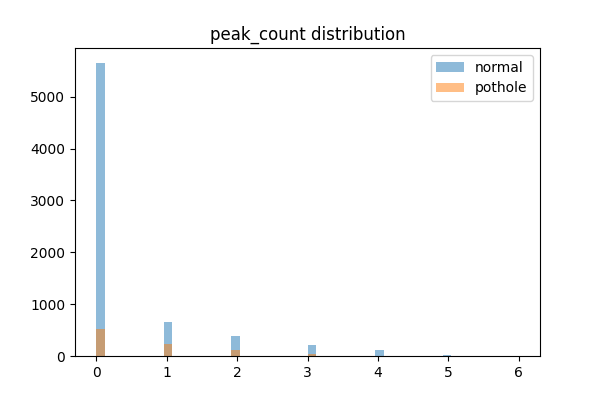

스마트팩토리 노면 및 바닥 상태 실시간 감지 시스템 (Factory-Twin Guard) 구축 보고서

1. 프로젝트 개요 및 목적

본 프로젝트 'Factory-Twin Guard'는 스마트팩토리 환경 내 자율주행 로봇 및 운송 차량이 이동하는 노면과 바닥 상태의 이상(포트홀, 거친 표면, 재질 변화 등)을 자동으로 감지하는 것을 목적으로 한다.
이를 위해 로봇 및 차량에 부착된 IMU(관성 측정 장치) 센서 데이터를 수집·분석하여 기계학습 기반의 이상 감지 모델을 구축하며, 감지된 이상 상태를 실시간 웹 대시보드(Web Dashboard)를 통해 관제자가 즉각적으로 파악하고 대응할 수 있는 모니터링 시스템의 개발을 최종 목표로 삼는다.

--------------------------------------------------

2. 원본 데이터 세트 개요

본 연구는 공장 내외부의 복합적인 환경을 포괄하기 위해 실내 바닥 재질 데이터와 실외 노면 이상 데이터의 두 가지 원본 데이터 세트를 활용한다.

2.1 실내 바닥 재질 데이터 (Indoor Surface Data)

로봇이 실내를 주행하는 동안 차체에 부착된 IMU 센서로부터 수집된 시계열 데이터이다.
- 구조: 각 샘플(series_id)은 128개의 시간 단위(Time-step) 측정치로 구성됨.
- 주요 센서:
  가. 방향 (Orientation): 4차원 쿼터니언(Quaternion) 벡터
  나. 각속도 (Angular Velocity): 3축 (X, Y, Z)
  다. 선형 가속도 (Linear Acceleration): 3축 (X, Y, Z)

2.2 실외 노면 이상 데이터 (Outdoor Pothole Data)

실외 주행 시 발생하는 포트홀(Pothole) 및 과속 방지턱 등 비정상 노면 상태를 기록한 데이터이다.
- 구조: 복수의 주행(Trip) 동안 기록된 연속적인 센서 데이터 스트림과 포트홀 발생 시점의 타임스탬프(Timestamp) 라벨로 구성됨.
- 주요 센서: 3축 가속도 (Accelerometer X, Y, Z), 차량 속도 (Speed), 자이로스코프 X축 회전율 등

--------------------------------------------------

3. 탐색적 데이터 분석 (Exploratory Data Analysis)

수집된 데이터의 통계적 특성 및 구조적 문제를 파악하기 위해 탐색적 데이터 분석(EDA)을 수행하였다. 각 시각화 자료에서 도출된 주요 발견 사항은 이후 전처리 기법 선정의 근거로 활용된다.

3.1 실내 데이터 (Indoor) 분석 결과

1) 타겟 클래스 분포

[그림 3-1] 실내 데이터 바닥 재질별 샘플 수 분포

분석 결과, 특정 바닥 재질(예: 콘크리트 계열)의 샘플 수가 여타 재질에 비해 현저히 많은 클래스 불균형(Class Imbalance) 현상이 확인되었다. 이러한 불균형 상태에서 모델을 학습할 경우, 다수 클래스에 편향된 예측이 발생하여 소수 클래스에 대한 인식 성능이 저하될 우려가 있다. 이에 따라 모델 평가 시 단순 정확도(Accuracy)보다는 클래스 불균형에 강건한 F1-Score를 주요 평가 지표로 채택하기로 한다.

2) 피처 간 상관관계 분석

[그림 3-2] 실내 데이터 피처 상관계수 히트맵

피어슨 상관계수 히트맵을 통해, 쿼터니언(Orientation) 센서의 각 축(X, Y, Z, W) 간에 매우 강한 선형 상관관계가 존재함을 확인하였다. 상관관계가 과도한 변수들을 그대로 모델 입력으로 사용할 경우 다중공선성(Multicollinearity) 문제가 발생할 수 있으며, 이는 모델 학습의 안정성을 저해한다. 이를 해소하기 위해 4차원의 쿼터니언 좌표를 물리적 의미가 명확한 3개의 독립적인 오일러 각도(Roll, Pitch, Yaw)로 변환하는 전처리를 수행한다.

3) 주성분 분석(PCA) 기반 군집 구조 시각화

[그림 3-3] 전처리 피처의 PCA 2차원 투영 산점도

전처리된 고차원 피처 공간을 주성분 분석(PCA)을 통해 2차원으로 축소하여 클래스 간 분리 가능성을 시각적으로 검토하였다. 투영 결과, 다수의 클래스가 서로 복잡하게 중첩(Overlap)되어 있어 선형 결정 경계로는 분류가 어려운 비선형적 관계임이 확인되었다. 따라서 Logistic Regression 등 선형 모델보다는 비선형 경계 형성에 유리한 트리 기반 앙상블 기법(Random Forest, XGBoost)의 적용이 적합하다고 판단된다.

3.2 실외 데이터 (Outdoor) 분석 결과

1) 타겟 라벨 분포 (정상 주행 vs. 노면 이상)

[그림 3-4] 실외 데이터 정상/이상 노면 샘플 수 분포

분석 결과, 정상 주행 구간 데이터가 포트홀(이상) 구간 데이터에 비해 압도적으로 많은 극단적인 클래스 불균형이 관찰되었다. 이는 희소 이상 탐지(Rare Anomaly Detection)의 전형적인 특성으로, 불균형을 보정하지 않으면 모델이 정상 클래스만을 예측하는 방향으로 학습될 위험이 있다. 이에 따라 전처리 단계에서 다운샘플링(Downsampling) 또는 SMOTE 오버샘플링 기법의 도입이 필수적이다.

2) 핵심 피처 분포 분석 (수직 가속도 최대값 및 피크 횟수)

[그림 3-5] 정상/이상 노면별 Z축 가속도 최대값(acc_z_max) 분포

[그림 3-6] 정상/이상 노면별 가속도 피크 발생 횟수(peak_count) 분포

차량이 포트홀을 통과할 때 발생하는 수직 방향 충격은 가속도 Z축(acc_z_max) 값의 급격한 상승으로 나타난다. 밀도 함수 분포를 통해 정상 노면과 이상 노면 간에 해당 값의 분포가 명확하게 분리됨을 확인하였다. 또한 수직 충격의 빈도를 나타내는 피크 발생 횟수(peak_count) 역시 두 클래스 간 분포 차이가 뚜렷하여, Z축 기반 통계 지표와 피크 횟수가 모델의 핵심 판별 변수가 될 것으로 판단된다.

--------------------------------------------------

4. 데이터 피처 엔지니어링 및 전처리 파이프라인

3장의 EDA를 통해 파악된 데이터의 구조적 특성과 문제점을 기반으로, 모델 성능을 극대화하기 위한 전처리 파이프라인을 구축하였다.

4.1 실내 데이터 전처리 (Indoor)

1) 쿼터니언의 오일러 각도(Euler Angles) 변환
   3.1절의 상관관계 분석에서 확인된 쿼터니언 축 간의 다중공선성 문제를 해소하고, 로봇의 물리적 자세 변화(Roll: 좌우 기울기, Pitch: 앞뒤 기울기, Yaw: 진행 방향 회전)를 모델이 직관적으로 학습할 수 있도록 4차원 쿼터니언 벡터를 3개의 독립적인 오일러 각도로 변환하였다.

2) 벡터 크기(Magnitude) 및 동적 변화량(Diff) 추출
   센서의 3축 데이터는 로봇의 이동 방향에 종속적이지만, 노면 재질에 따른 진동의 강도는 방향과 무관한 절대적 물리량이다. 이에 가속도 및 각속도 벡터의 유클리드 크기(Magnitude, sqrt(X^2 + Y^2 + Z^2))를 산출하여 방향 의존성을 제거하였으며, 타임스텝 간 차분값(Diff)을 통해 진동의 순간 변화율 정보를 파생 변수로 추가하였다.

3) 시계열 시퀀스의 기술 통계량 요약 (Statistical Aggregation)
   각 시퀀스(series_id)는 128개의 시간 단위 측정치로 구성되어 있으나, 트리 기반 분류 모델은 고정 길이의 1차원 벡터 입력을 요구한다. EDA에서 재질별 피처 분포의 형태가 상이함을 확인한 결과를 바탕으로, 단순 평균(mean)만이 아닌 표준편차(std), 왜도(skew), 첨도(kurtosis) 등 분포의 형태를 포착할 수 있는 다양한 기술 통계량을 산출하여 1차원 피처 벡터로 변환하였다.

4.2 실외 데이터 전처리 (Outdoor)

1) 슬라이딩 윈도우(Sliding Window) 기반 시계열 분할
   주행 센서 데이터는 연속적인 스트림 형태이므로, 모델이 특정 시간 구간 단위로 이상 여부를 판단할 수 있도록 크기 20의 슬라이딩 윈도우(WINDOW_SIZE=20)를 적용하여 데이터를 분할하였다. 각 윈도우의 중심 시간 내에 포트홀 타임스탬프가 포함될 경우 해당 윈도우를 이상(Abnormal) 구간으로 라벨링하였다.

2) 피크(Peak) 검출 및 주요 통계 피처 추출
   scipy.signal.find_peaks 알고리즘을 활용하여 윈도우 내 수직(Z축) 가속도의 피크 발생 횟수를 파생 변수로 추출하였으며, Z축 가속도 최대값(acc_z_max), 표준편차(acc_z_std), 가속도 벡터 크기의 평균 및 변화량 등을 포함한 11개의 통계 피처를 산출하였다.

3) 이상치 클리핑(Clipping) 및 클래스 불균형 해소
   센서 노이즈 등으로 인해 발생하는 극단적 이상치는 IQR(사분위 범위) 기반 클리핑으로 처리하였다. 또한 3.2절에서 확인된 극단적인 클래스 불균형을 해소하기 위해, 다수 클래스(정상 노면)를 소수 클래스(이상 노면) 수준으로 줄이는 다운샘플링(Downsampling)을 적용하여 학습 데이터의 클래스 비율을 균형 있게 조정하였다.

--------------------------------------------------

5. 이상 감지 모델링 (Modeling)
(추후 작성 예정)

본 파트는 4장에서 구축된 전처리 데이터셋을 기반으로 최적의 기계학습 알고리즘을 선정하고, 성능을 평가하는 과정을 기술한다.

5.1 모델 선정 및 학습
- 후보 알고리즘: Random Forest, XGBoost 등 앙상블 트리 계열
- 교차 검증(Cross-Validation) 및 하이퍼파라미터 최적화

5.2 모델 성능 평가
- 평가 지표: F1-Score, Precision, Recall, Confusion Matrix
- 실내/실외 모델 각각의 최종 성능 결과 정리

--------------------------------------------------

6. 실시간 관제 웹 서비스 (Web Application)
(추후 작성 예정)

본 파트는 학습된 모델을 스마트팩토리 관제 시스템에 연동하여 실시간 모니터링 환경을 구축하는 아키텍처 및 구현 사항을 기술한다.

6.1 시스템 아키텍처
- 데이터 수집 -> 실시간 추론 -> 웹 소켓 브로드캐스팅 흐름 설계

6.2 웹 프론트엔드 대시보드
- 이상 감지 알람 및 로봇/차량 위치 기반 노면 상태 시각화 지도

6.3 사용 기술 스택
- 백엔드 API: FastAPI
- 프론트엔드: Next.js / React (검토 중)

--------------------------------------------------

7. 결론 및 향후 개선 방향
(추후 작성 예정)

7.1 결론
- 본 프로젝트를 통해 달성한 주요 성과 요약
- 실내/실외 이상 감지 모델의 최종 성능 지표 정리
- 실시간 웹 관제 시스템의 안정성 및 응답 속도 평가 결과

7.2 한계점 및 향후 개선 방향
- 현재 시스템의 한계점 (예: 특정 센서 노이즈 환경, 미지원 노면 유형 등)
- 딥러닝(CNN, LSTM 등) 기반 시계열 분류 모델로의 확장 가능성 검토
- 실시간 추론 속도 최적화 (모델 경량화, Edge Computing 적용 등)
- 추가 센서(카메라, LiDAR 등) 융합을 통한 멀티모달 감지 고도화

--------------------------------------------------

8. 기대 효과 및 비즈니스 활용 방안
(추후 작성 예정)

8.1 기대 효과
- 스마트팩토리 내 노면 이상으로 인한 장비 파손 및 안전 사고 예방
- 사전 감지를 통한 시설 유지보수 비용 절감
- 실시간 관제를 통한 관리 인력 효율화 및 사고 대응 시간 단축

8.2 비즈니스 활용 방안
- 물류 창고, 제조 공장, 공항 등 다양한 산업 현장으로의 확장 적용
- 지자체 도로 관리 시스템과의 연계를 통한 스마트 시티 인프라 기여
- 자율주행 로봇/AGV 운영 기업 대상 SaaS 서비스 모델 제안
