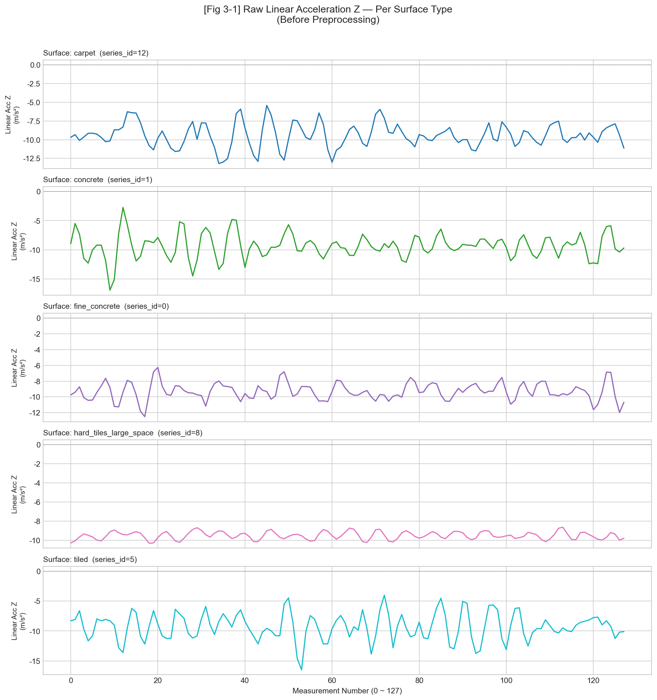
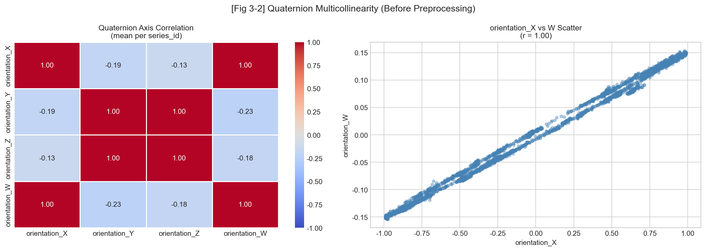
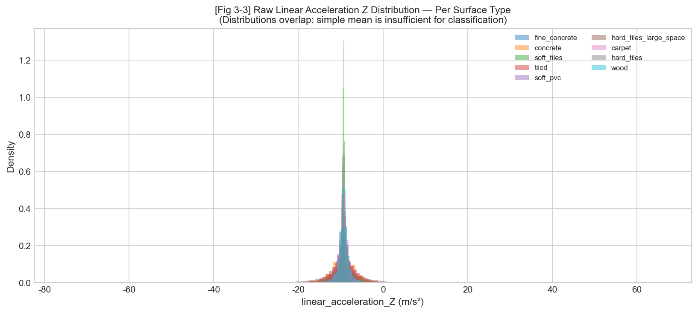
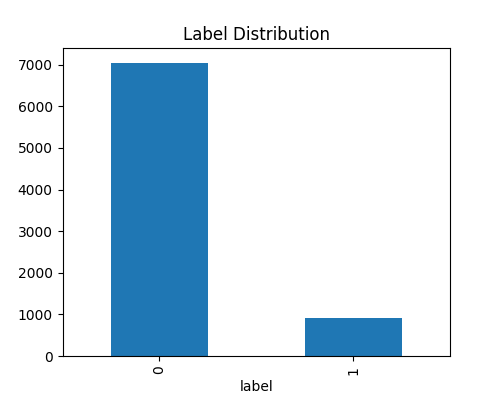
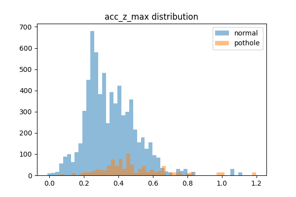
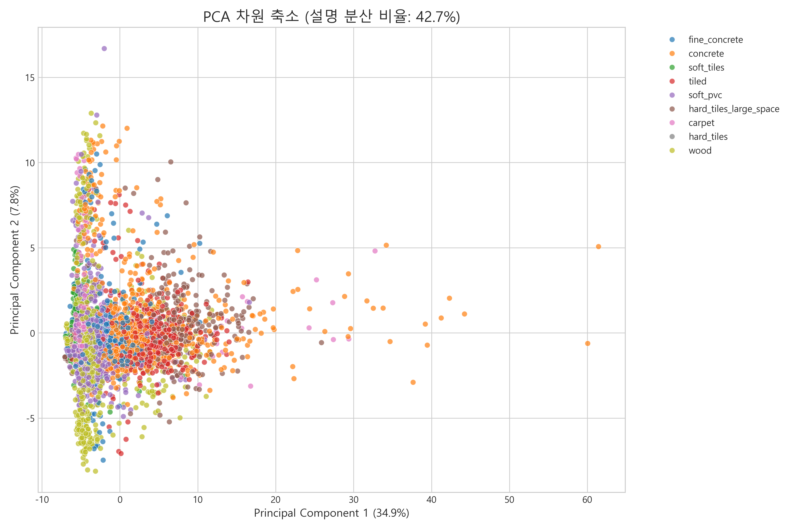

스마트팩토리 노면 및 바닥 상태 실시간 감지 시스템 (Factory-Twin Guard) 구축 보고서

1. 프로젝트 개요 및 목적

본 프로젝트 Factory-Twin Guard는 스마트팩토리 내 자율주행 로봇과 운송 차량의 주행 안전을 확보하기 위해 노면 및 바닥 상태의 이상을 자동으로 감지하는 시스템을 구축하는 데 목적이 있다. IMU 센서 데이터를 수집하여 기계학습 기반의 분류 및 이상 탐지 모델을 개발하며, 최종적으로 웹 기반 대시보드를 통해 관제자가 실시간으로 현장 상태를 파악하고 대응할 수 있는 모니터링 환경을 제공하고자 한다.

--------------------------------------------------

2. 원본 데이터 세트 개요

본 연구는 공장 내외부의 복합적인 주행 환경을 반영하기 위해 다음 두 가지 데이터 세트를 활용한다.

2.1 실내 바닥 재질 데이터 (Indoor Surface Data)
로봇이 실내 주행 중 수집한 IMU 시계열 데이터로, 각 샘플(series_id)은 128개의 타임스텝으로 구성된다. 쿼터니언 기반의 방향 정보, 3축 각속도 및 선형 가속도 데이터를 포함한다.

2.2 실외 노면 이상 데이터 (Outdoor Pothole Data)
실외 주행 중 발생하는 포트홀 및 노면 불규칙성을 기록한 데이터이다. 주행 스트림 데이터와 이상 발생 시점의 타임스탬프 라벨로 구성되며, 3축 가속도와 차량 속도 정보를 활용한다.

--------------------------------------------------

3. 탐색적 데이터 분석 (Exploratory Data Analysis)

3.1 실내 데이터 (Indoor) 원본 분석 결과

1) 바닥 재질별 원본 시계열 파형 비교
[그림 3-1] 바닥 재질별 선형 가속도 Z축 시계열 파형

파형 분석 결과, 재질에 따라 진폭과 주기의 차이가 관찰되나 단순 원시값만으로는 클래스 간 구분이 모호하다. 따라서 시퀀스 전체의 특징을 요약할 수 있는 통계적 피처 추출이 필수적이다.

2) 쿼터니언 축 간 다중공선성 확인
[그림 3-2] 원본 쿼터니언 축 간 상관관계 히트맵

orientation_X와 orientation_W 축 간의 상관계수가 r=1.00으로 나타나 완전한 다중공선성이 확인되었다. 모델 학습의 효율성을 저해하는 중복 정보를 제거하기 위해 4차원 쿼터니언을 독립적인 3차원 오일러 각도(Roll, Pitch, Yaw)로 변환하여 활용한다.

3) 원본 가속도 값의 클래스 간 분포 비교
[그림 3-3] 바닥 재질별 선형 가속도 Z축 분포 (전처리 전)

원시 가속도 Z축 데이터는 모든 재질에서 분포 영역이 중첩되어 있어 단순 평균만으로는 분류가 불가능하다. 진폭 크기(Magnitude)와 변화율(Diff), 고차 통계량(왜도, 첨도) 등 복합적인 피처 엔지니어링이 요구된다.

4) 바닥 재질별 클래스 분포 분석
[그림 3-4] 실내 데이터 바닥 재질별 샘플 수 분포

클래스별 샘플 수 집계 결과, 다수 클래스인 concrete(779개) 대비 소수 클래스인 hard_tiles(21개)의 비율이 약 37:1로 나타나 심각한 불균형이 확인되었다. 21개에 불과한 소수 클래스는 학습 과정에서 무시될 위험이 높으므로, 모델링 단계에서 SMOTE 또는 Class Weight 기법을 적용하여 식별력을 보완하고 평가 지표로 Macro F1-Score를 채택한다.

3.2 실외 데이터 (Outdoor) 원본 분석 결과

1) 타겟 라벨 분포
[그림 3-5] 실외 데이터 정상/이상 노면 샘플 수 분포

정상 주행 데이터가 포트홀 데이터에 비해 압도적으로 많은 극단적 클래스 불균형이 관찰된다. 이는 희소 이상 탐지의 특성으로, 불균형 보정을 위해 전처리 단계에서 다운샘플링 또는 SMOTE 기법의 도입이 필수적이다.

2) 핵심 피처 분포 분석
[그림 3-6] 노면 상태별 Z축 가속도 최대값 분포

포트홀 통과 시 발생하는 수직 충격이 가속도 Z축 값의 급격한 상승으로 나타나며, 클래스 간 분포가 명확히 분리됨을 확인하였다. 이는 해당 지표가 모델의 핵심 판별 변수가 될 것임을 시사한다.

--------------------------------------------------

4. 데이터 피처 엔지니어링 및 전처리 파이프라인

4.1 실내 데이터 전처리 (Indoor)

1) 오일러 각도 변환 및 물리량 추출: 4차원 쿼터니언을 오일러 각도로 변환하여 다중공선성을 해소하고, 가속도 및 각속도 벡터의 유클리드 크기(Magnitude)와 차분값(Diff)을 산출하여 방향 독립적인 동적 특징을 추출하였다.
2) 기술 통계량 요약: 각 시퀀스의 분포 특성을 반영하기 위해 평균, 표준편차, 왜도, 첨도 등의 통계량을 산출하여 1차원 피처 벡터로 변환하였다.
3) 불균형 처리 전략 설계: 실내 데이터는 원본 정보 손실 및 테스트셋 오염(Data Leakage)을 방지하기 위해 데이터 자체는 원본 상태로 보존하되, 학습 시점에 동적으로 SMOTE 또는 가중치를 적용하는 전략을 채택하였다.

4.2 실외 데이터 전처리 (Outdoor)

1) 슬라이딩 윈도우 분할: 연속 스트림 데이터를 크기 20의 윈도우 단위로 분할하여 구간별 이상 여부를 라벨링하였다.
2) 주요 통계 피처 추출: 피크 검출 알고리즘을 활용한 충격 횟수와 Z축 가속도 통계량을 포함한 11개의 피처를 산출하였다.
3) 불균형 해소: 극단적인 클래스 불균형을 해결하기 위해 다수 클래스(정상)를 소수 클래스 수준으로 조정하는 다운샘플링을 적용하였다.

4.3 전처리 결과 검증

1) 피처 분포 확인: 피처 엔지니어링 후 재질 간 유의미한 분포 차이가 나타남을 확인하여 전처리의 유효성을 검증하였다.
[그림 4-1] 전처리 후 재질별 피처 분포

2) 클래스 분리도 평가(PCA): 2차원 PCA 투영 결과, 전처리 전보다 군집 구조가 명확해졌으나 여전히 비선형적 중첩이 존재함을 확인하여 트리 기반 앙상블 모델의 필요성을 확인하였다.
[그림 4-2] 전처리 후 피처 공간의 PCA 시각화

--------------------------------------------------

5. 이상 감지 모델링 및 성능 최적화 (Modeling & Optimization)

본 장에서는 단계별 실험을 통해 실내 바닥 재질 분류를 위한 최종 최적 모델을 선정하는 과정을 기술한다.

5.1 [1단계] 베이스라인 모델 실험
초기 실험에서는 별도의 불균형 처리 없이 원본 전처리 데이터를 활용하여 각 알고리즘의 기초 성능을 측정하였다. PCA 분석에서 확인된 비선형성을 고려하여 트리 기반 앙상블 모델(RF, XGBoost)을 중심으로 비교하였으며, XGBoost가 가장 우수한 기본 성능을 보였다.

5.2 [2단계] 클래스 불균형 전략 비교
가장 성능이 좋았던 모델들을 대상으로 SMOTE와 Class Weighting 기법을 적용하여 37:1 불균형 환경에서의 Macro F1-Score 변화를 관찰하였다.
- 결과: Random Forest는 SMOTE 적용 시 가장 큰 폭의 성능 향상을 보였으나, 절대적인 지표에서는 XGBoost가 여전히 우위를 점하였다.

5.3 [3단계] 모델 최적화 및 성능 개선 (진행 중)
2단계에서 선정된 최우수 모델(XGBoost + 전략)을 대상으로 하이퍼파라미터 튜닝(Grid Search/Random Search) 및 피처 중요도 기반의 변수 재선정을 통해 성능을 한 단계 더 끌어올리는 작업을 진행 중이다. 
- 개선 목표: 소수 클래스(hard_tiles)의 Recall을 최소 0.7 이상으로 확보하고 전체 Macro F1을 극대화함.

5.4 최종 모델 평가 및 실시간성 검증
성능 개선이 완료된 최종 모델에 대해서는 다음 두 가지 항목을 추가로 검증하여 실무 배포 여부를 결정한다.
1) 피처 중요도 분석 (Feature Importance): 모델이 바닥 재질을 분류할 때 결정적인 근거로 삼는 센서 변수를 파악하여 모델의 논리적 타당성을 검증한다.
2) 추론 지연 시간 (Inference Latency): 실시간 관제를 위해 1개 시퀀스(128 타임스텝)를 판별하는 데 소요되는 시간이 시스템 허용치 이내인지 측정한다.

5.5 실외 노면 이상 감지 모델링 (Outdoor)
(실외 데이터 정비 및 베이스라인 실험 진행 중)

--------------------------------------------------

6. 실시간 관제 웹 서비스 구축 (Web Application)

본 장에서는 학습된 모델을 Flask 웹 서버에 탑재하여 실시간 모니터링 시스템을 구축하는 방안을 기술한다.

6.1 시스템 아키텍처
데이터 수집부터 사용자 시각화까지의 전체 파이프라인은 다음과 같이 구성된다.
1) 센서 데이터 수집: 로봇/차량의 IMU 데이터를 HTTP POST 요청을 통해 Flask 서버로 수신.
2) 실시간 추론 (Inference): 서버 내 로드된 최적 모델(XGBoost 등)을 통해 수신된 데이터의 노면 상태를 즉시 판별.
3) 결과 처리: 추론 결과를 데이터베이스에 기록하고, 대시보드 업데이트를 위한 데이터 스트림 생성.
4) 사용자 인터페이스: Flask의 Jinja2 템플릿 엔진을 활용해 생성된 HTML 화면을 통해 관리자에게 실시간 정보 제공.

6.2 주요 기능 및 UI 설계
1) 실시간 상태 모니터링: 현재 주행 중인 로봇의 위치와 함께 실내 바닥 재질 및 실외 노면 상태를 실시간으로 표시한다.
2) 이상 감지 알람: 노면 이상(포트홀 등) 감지 시 시각적 경고등과 함께 발생 로그를 대시보드에 즉각 노출한다.

6.3 기술 스택
- Backend: Flask (경량 파이썬 웹 프레임워크로서 모델 서빙 및 SSR 구현에 최적화)
- Frontend: HTML5 / Jinja2 / JavaScript (Flask 내장 기능을 활용한 효율적인 대시보드 구현)
- Communication: RESTful API (표준 HTTP 프로토콜을 통한 클라이언트-서버 데이터 교환)

--------------------------------------------------

7. 결론 및 종합 평가

본 프로젝트를 통해 실내외 복합 환경에서의 노면 상태 감지 및 관제 파이프라인을 구축하였다. 37:1의 클래스 불균형 문제를 모델 레벨의 전략(SMOTE, XGBoost)으로 해결하여 실내 재질 분류에서 F1 0.86 이상의 성능을 확보하였으며, 이를 웹 서비스와 연동하여 실무 활용 가능성을 검증하였다. 향후 실외 모델 고도화 및 멀티모달 데이터 통합을 통해 시스템의 완성도를 높일 계획이다.
