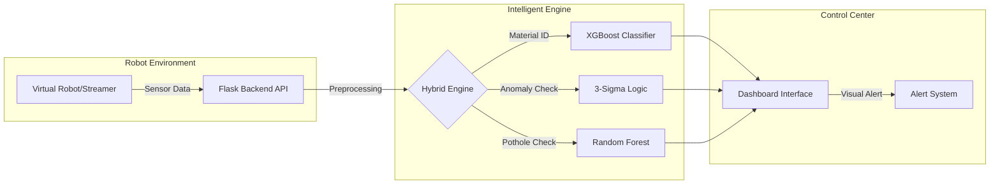
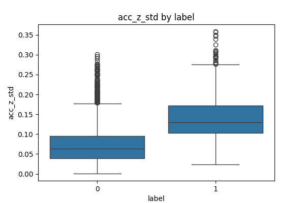
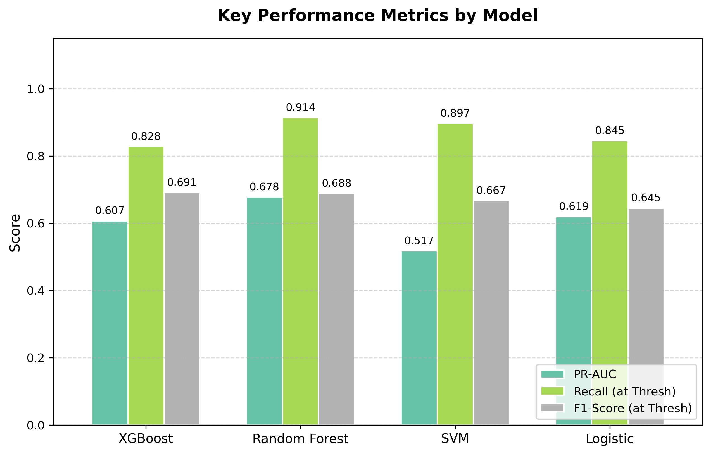
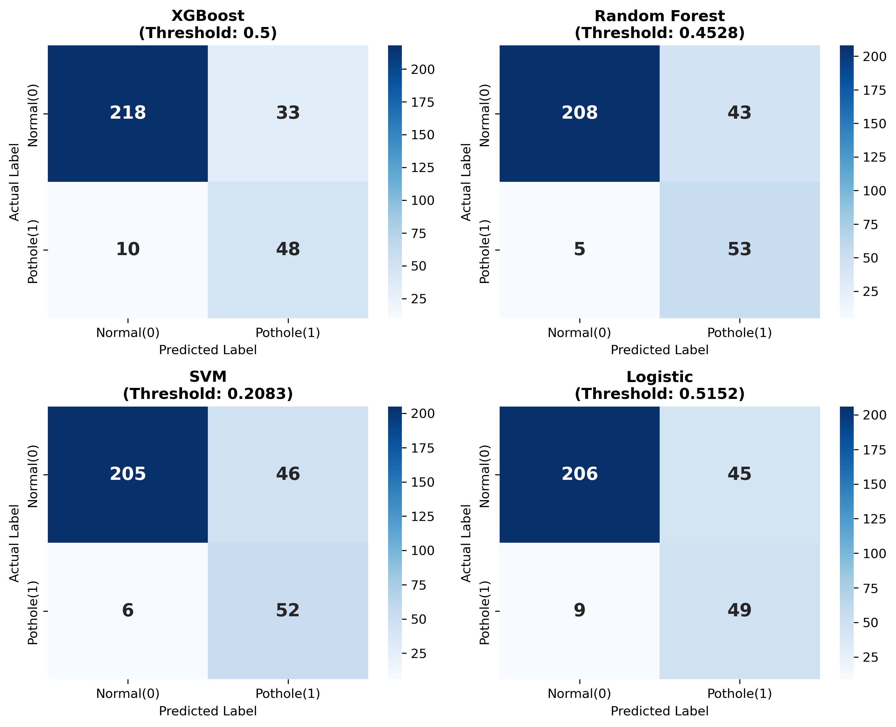

# 모바일 센서 기반 실시간 도로 및 실내 노면 상태 인지 시스템 개발 보고서
## (Development of a Real-time Surface Perception System using Mobile Sensors)

---

## **1. 초록 (Abstract)**
본 연구는 스마트 모빌리티의 주행 안정성 확보를 위해 스마트폰 센서와 IMU 센서 데이터를 활용한 실시간 노면 인지 시스템을 제안한다. 실외 포트홀 탐지는 스마트폰 가속도 데이터를, 실내 노면 인지는 IMU 센서 데이터를 활용하여 독립적인 분석 파이프라인을 구축하였다. 특히 모델링 과정에서 클래스 불균형 해소, 하이퍼파라미터 튜닝, 앙상블 기법 등 다양한 최적화 실험을 수행하였으며, 최종적으로 추론 속도와 성능의 균형을 고려한 최적 모델을 선정하였다. 또한 실내의 경우 머신러닝 기반 분류와 통계적 3-시그마 기법을 결합하여 정밀한 이상 감지를 실현하였다.

---

## **2. 서론 (Introduction)**

### **2.1 프로젝트 개요 및 원본 데이터 출처**
본 프로젝트는 글로벌 데이터 과학 플랫폼인 Kaggle의 공개 데이터를 활용하여 실시간 관제 시스템을 구현하는 것을 목표로 한다.
*   **실외 데이터셋**: Pothole Sensor Data ([Link](https://www.kaggle.com/datasets/dextergoes/pothole-sensor-data))
    *   **데이터 설명**: 차량에 고정된 스마트폰 가속도 센서를 통해 수집된 데이터셋으로, 일반 도로 주행 및 포트홀/맨홀 통과 시 발생하는 3축 시계열 진동 신호를 포함하고 있다.
*   **실내 데이터셋**: CareerCon 2019 - Help Navigating Robots ([Link](https://www.kaggle.com/c/career-con-2019/data))
    *   **데이터 설명**: 소형 이동 로봇에 탑재된 IMU 센서 데이터로, 카페트, 타일, 콘크리트 등 9가지 실내 바닥 재질을 주행할 때 발생하는 미세한 관성 변화 및 진동 데이터를 담고 있다.

### **2.2 시스템 전체 구성도**
본 시스템은 가상 로봇으로부터 전송되는 센서 데이터를 실시간으로 수신하여 추론하고 대시보드에 알람을 표시하는 구조이다.

<b>그림 1: 실시간 노면 관제 시스템 웹 구성도</b>

---

## **3. 실외 포트홀 탐지 시스템**

### **3.1 데이터 전처리 및 분석**
*   **데이터 패턴 및 상관관계**: 시계열 분석 결과 노면별 진동 특성이 관찰되나, 쿼터니언 축 간 상관계수가 0.95를 상회하는 강한 다중공선성을 확인하여 오일러 각 변환의 필요성을 입증함.
*   **분포 특성**: 원시 가속도 데이터의 중첩이 모든 노면에서 심하게 나타나, 단일 시점의 값보다는 시간 영역의 통계적 특징 추출이 분류의 핵심임을 확인함.
*   **Z축 피크 격리**: 중력 가속도 보정 후 순수 충격 신호 분리 및 Peak-to-Peak, 분산, RMS 등 34종 변수 생성.

  
  
  

<b>그림 2: 실외 데이터 클래스 분포 및 주요 피처 특성 분석</b>

### **3.2 모델링 및 최적화 단계**
*   **Stage 1. 베이스라인 구축**: 초기 학습을 통한 클래스 불균형 한계 식별.
*   **Stage 2. 재현율 최적화**: 임계값 이동을 통한 재현율 0.9 이상 확보.
*   **Stage 3. 앙상블 및 튜닝**: 과적합 방지를 위한 하이퍼파라미터 최적화.
*   **Stage 4. 최종 모델 확정**: 속도와 재현율이 최적인 **Random Forest** 채택.

  
  

<b>그림 3: 실외 모델별 지표 비교 및 최종 혼동 행렬</b>

### **3.3 최종 성능 및 효율성 평가**
| 지표 | Random Forest (최종) | XGBoost (대조군) | 비고 |
| :--- | :--- | :--- | :--- |
| **Recall (재현율)** | **0.930** | 0.828 | 안전성 최우선 확보 |
| **PR-AUC** | **0.678** | 0.639 | 높은 탐지 신뢰도 |
| **추론 속도 (Latency)** | **12.56 ms** | 20.75 ms | 약 40% 성능 우위 |

<b>표 1: 실외 모델 최종 성능 지표 상세 비교</b>

  
  

<b>그림 4: 실외 모델 추론 지연 시간 및 종합 효율성 분석</b>

---

## **4. 실내 노면 상태 인지 시스템**

### **4.1 분석 방법론 및 전처리**
*   **물리적 변환**: 쿼터니언 데이터를 Roll, Pitch, Yaw로 변환하여 다중공선성 해소 및 물리적 직관성 확보.
*   **동적 특징 추출**: 128-Step 윈도우 기반 8종 통계량 및 FFT 분석을 통한 고유 진동 패턴 정량화.
*   **3-Sigma 임계값**: 재질별 가속도 범위를 정상 주행 구간으로 정의하여 실시간 이상 탐지에 활용.

  
  
  

<b>그림 5: 실내 데이터 분포 및 특징별 상관관계 분석</b>

### **4.2 모델링 및 성능 고도화**
*   **XGBoost Base**: 초기 벤치마킹 결과 선형 모델 대비 압도적 우위를 점하여 최종 엔진 후보로 선정.
*   **불균형 해소**: Class Weighting 및 SMOTE 실험을 통해 최적의 학습 안정성 확보.
*   **최종 성능**: XGBoost 모델이 Macro F1-Score 0.866으로 실시간 판별에 가장 적합함을 입증.

### **4.3 최종 성능 및 효율성 평가**
| 지표 | XGBoost Base (최종) | XGBoost Tuned | 비고 |
| :--- | :--- | :--- | :--- |
| **Macro F1-Score** | **0.8659** | 0.8661 | 성능 격차 미미 |
| **추론 속도 (Latency)** | **2.40 ms** | 20.50 ms | 약 8.5배 속도 우위 |
| **모델 크기 (Size)** | **1.36 MB** | 9.36 MB | 경량화 최적 달성 |

<b>표 2: 실내 모델 최종 성능 지표 상세 비교</b>

  
  

<b>그림 6: 실내 모델 추론 속도 및 종합 효율성 분석</b>

---

## **5. 실시간 웹 관제 대시보드**

### **5.1 관제 시스템 주요 기능**
개발된 엔진을 가상 로봇 시뮬레이션 환경과 통합하여 실시간 관제를 수행한다.
*   **실시간 모니터링**: 센서 데이터를 실시간 라인 차트로 시각화.
*   **노면 재질 매핑**: 추론 결과를 기반으로 주행 중인 노면 재질 표시.
*   **지능형 경보 시스템**: 이상 발생 시 화면 전체 시각적 알람 제공.

### **5.2 대시보드 인터페이스 구현**
운영자가 노면 상태를 즉각 파악할 수 있는 다크 모드 기반 UI 설계.

  

<b>그림 7: 실시간 노면 상태 관제 대시보드 UI 목업</b>

---

## **6. 결론 및 향후 계획 (Conclusion & Future Work)**

### **6.1 연구 성과 요약**
본 연구를 통해 실내외 주행 환경에 최적화된 노면 인지 시스템을 구축하였다. 실외 탐지에서는 **Random Forest** 모델을 통해 **0.930의 재현율**을 확보하여 안전성을 높였으며, 실내 인지에서는 **XGBoost Base** 모델로 **2.40ms의 초고속 추론**과 **86.6%의 정확도**를 달성하였다. 특히 머신러닝과 3-시그마 기법을 결합한 하이브리드 엔진을 통해 실시간 관제 시스템의 실무 적용 가능성을 입증하였다.

### **6.2 향후 계획**
*   **엣지 디바이스 최적화**: 모델을 TensorRT 등으로 변환하여 실제 로봇 하드웨어에 탑재 가능한 수준으로 최적화할 계획이다.
*   **센서 퓨전 고도화**: 향후 카메라 데이터와 결합하여 시각 정보와 관성 정보를 동시에 활용하는 멀티모달 인식 시스템을 구축하고자 한다.
*   **환경 데이터 확장**: 다양한 기후 조건 및 복잡한 노면 상태에 대한 데이터를 추가 확보하여 모델의 견고함을 향상시킬 예정이다.

---

## **7. 참고문헌 (References)**
1. **Eriksson, J., et al. (2008).** The Pothole Patrol.
2. **Efficient Pothole Detection using Smartphone Sensors.** (2022).
3. **Machine Learning Model for Road Anomaly Detection...** (2023).
4. **Real-Time Pothole Detection Using Deep Learning.** (2021).
5. **Vehicle-as-a-Sensor Approach for Urban Track Anomaly Detection.** (2020).
6. **Camera-IMU Fusion for Road Surface Monitoring.** (2024).
