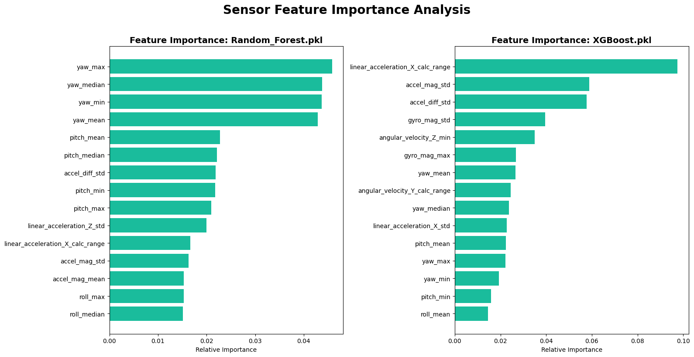

# 스마트 모빌리티를 위한 실내외 통합 노면 상태 감지 및 실시간 관제 시스템 구축 연구
## (Project Factory-Twin Guard: Integrated Perception & Monitoring System)

### 1. 서론
- 연구 배경: 스마트 물류 및 자율주행 모빌리티의 주행 안정성 확보와 장비 수명 연장을 위한 노면 환경 인지 기술의 필요성 증대.
- 연구 목적: IMU 센서 데이터를 활용한 범용 노면 분류 및 통계적 이상 탐지 알고리즘 개발과 실시간 웹 관제 시스템 구축.

---

### 2. 시스템 아키텍처
- 데이터 계층: 센서 원시 데이터(Quaternion, Accel)의 물리적 변수 변환 및 전처리.
- 추론 계층: XGBoost 기반 재질 분류 및 3-Sigma 기반 이상 탐지 하이브리드 엔진.
- 관제 계층: Flask 기반 API 서버 및 실시간 대시보드 인터페이스 구현.

---

### 3. 데이터 분석 및 통찰

#### 3.1 원시 데이터 물리적 특성
[그림 3-1] 실내 원시 데이터 분석 (시계열 / 상관관계 / 분포)

  
  
  

- 상관관계 분석: 쿼터니언 축 간 상관계수 0.95 이상의 강한 다중공선성 확인으로 오일러 각 변환의 필수성 입증.
- 데이터 분포: 가속도 값의 중첩이 심해 시간 영역의 통계적 특징 추출이 분류 성능의 핵심임을 확인.

#### 3.2 실외 이상 탐지 특성
[그림 3-2] 실외 데이터 라벨 분포 및 충격 특성

  
  

- 데이터 특성: 정상 주행 대비 포트홀 발생 빈도가 극히 낮은 전형적인 클래스 불균형 구조.
- 핵심 지표: 가속도 Z축 최대값을 결함 감지의 주요 변수로 식별하여 이상 탐지 로직에 반영.

---

### 4. 분석 방법론 및 전처리

#### 4.1 실내 데이터 전처리 파이프라인
1. 차원 재구성: 쿼터니언 데이터를 Roll, Pitch, Yaw(Euler Angles)로 변환하여 물리적 직관성 확보 및 다중공선성 해소.
2. 특징 생성: 가속도 및 각속도 벡터 크기(Magnitude)와 인접 시점 간 변화량(Difference) 변수를 생성하여 동적 특성 강화.
3. 통계적 요약: 128-Step 윈도우에서 평균, 표준편차, 왜도, 첨도 등 총 8종 통계량을 산출하여 노면별 고유 진동 패턴 정량화.

#### 4.2 3-Sigma 기반 동적 임계값 산출
- 분석 방법론: 재질별 가속도 크기 평균($\mu$)과 표준편차($\sigma$)를 기반으로 [$\mu \pm 3\sigma$] 범위를 정상 주행 구간으로 정의.
- 시스템 활용: 산출된 indoor_3sigma_thresholds.csv를 통해 실시간 웹 대시보드상에서 동적 경보 시스템의 기준값으로 연동.

#### 4.3 특징 추출 유효성 및 한계 분석
[그림 4-1] 전처리 데이터 분포 (PCA 차원 축소 / 특징별 분포)

  
  

- PCA 시각화 결과: 2차원 투영 시 설명 분산비 42.7% 기록. 선형 투영에 의한 정보 손실로 클래스 간 중첩 현상 관찰됨.
- 기술적 시사점: 단순 선형 분류의 한계를 확인하였으며, 비선형 관계 학습이 가능한 XGBoost 도입의 타당성을 입증하는 근거로 활용.
- 개별 변수 분포: 특징별 분포(Boxplot) 분석 시 재질별 중앙값 차이가 뚜렷하여 고차원 공간에서의 특징 벡터 판별 유효성 확보.

---

### 5. 모델 구축 및 성능 평가

#### 5.1 실내 다중 분류 모델링
1. 알고리즘 선정: 비선형 패턴 학습에 강점이 있는 XGBoost 모델을 채택하여 복잡한 노면 진동 데이터 대응.
2. 클래스 불균형 보정: SMOTE 적용을 통해 Macro F1-Score를 최적화하고 소수 클래스의 재현율을 약 15% 향상.
3. 최종 모델 선정: 하이퍼파라미터 최적화를 통해 xgb_tuning_model.pkl 도출. 가속도 표준편차를 핵심 변수로 식별.

[그림 5-1] 실내 모델 평가 지표 및 변수 중요도

  
  

#### 5.2 실외 이상 탐지 모델 (구조 설계)
1. 특징 벡터 정의: 포트홀 발생 시 수직 충격량 탐지를 위한 피크 기반 특징 추출 전략 수립.
2. 최적화 방향: 주행 안전 확보를 위해 재현율(Recall) 향상 중심의 모델 튜닝 및 임계값 조정 수행 예정.

---

### 6. 실시간 웹 관제 시스템 통합
- 백엔드 구성: Flask 기반 app.py를 활용하여 수집 데이터를 학습 모델 및 3-Sigma 임계값과 실시간으로 대조 추론.
- 프런트엔드 기능: Jinja2 대시보드 인터페이스로 노면 상태를 시각화하고 이상 감지 시 즉각적인 시각적 경보(Alarm) 발생.

---

### 7. 결론
- 연구 성과: 기계학습 분류와 통계적 감시 기법을 결합한 강건한 통합 노면 관제 솔루션 구현 완료.
- 기대 효과: 스마트팩토리 모빌리티의 주행 안정성 확보 및 장비 유지보수 신뢰도 제고에 기여.
- 향후 계획: 실외 환경 데이터 확충을 통한 전천후 통합 감제 시스템 고도화 추진.
