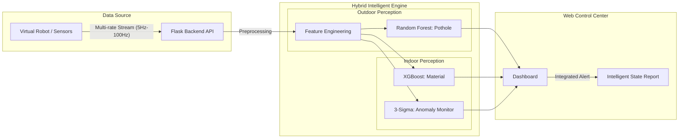
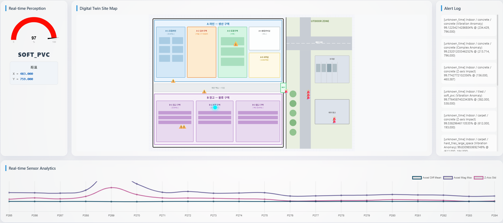

# [프로젝트 보고서] 모바일 센서 기반 실시간 도로 및 실내 노면 상태 인지 시스템 개발 (v5)
## (Development of a Real-time Surface Perception System using Mobile Sensors)

    

<h3> 2026. 04. 27 </h3>
 
<h3> [현대로템] K-방산 AI모델 개발과정 6기 1팀 </h3>
<h3> 조장 : 황수연, 팀원 : 이형철 이지원, 진강훈, 홍승현, 박준혁</h3>

## 목차 (Table of Contents)
1. [초록 (Abstract)](#1-초록-abstract)
2. [서론 (Introduction)](#2-서론-introduction)
    - 2.1 [프로젝트 정의 및 개요](#21-프로젝트-정의-및-개요)
    - 2.2 [시스템 전체 구성도](#22-시스템-전체-구성도)
    - 2.3 [이종 센서 이질성 극복 및 통합 전략](#23-이종-센서-이질성-극복-및-통합-전략-sensor-heterogeneity-resolution)
3. [실외 포트홀 탐지 시스템](#3-실외-포트홀-탐지-시스템)
    - 3.1 [데이터 전처리 및 분석](#31-데이터-전처리-및-분석)
    - 3.2 [모델링 및 최적화](#32-모델링-및-최적화)
    - 3.3 [최종 모델 선정 및 성능 검증](#33-최종-모델-선정-및-성능-검증)
4. [실내 노면 상태 인지 시스템](#4-실내-노면-상태-인지-시스템)
    - 4.1 [데이터 전처리 및 분석](#41-데이터-전처리-및-분석)
    - 4.2 [모델링 및 최적화](#42-모델링-및-최적화)
    - 4.3 [최종 모델 선정 및 성능 검증](#43-최종-모델-선정-및-성능-검증)
5. [실시간 웹 관제 대시보드](#5-실시간-웹-관제-대시보드)
6. [결론 및 향후 과제](#6-결론-및-향후-과제)
7. [참고문헌 (References)](#7-참고문헌-references)

## 1. 초록 (Abstract)
본 연구는 스마트 모빌리티의 주행 안정성 확보를 위해 스마트폰 센서와 IMU 센서 데이터를 활용한 실시간 노면 인지 시스템 및 웹 기반 통합 관제 플랫폼을 제안하였다. 실외 포트홀 탐지 및 실내 노면 재질 분류를 위해 독립적인 분석 파이프라인을 구축하였으며, 실물 코드 구현 단계에서 검증된 최적의 특징 추출 기법을 적용하였다. 연구 결과, 실외 탐지 시스템은 안전 최우선 지표인 재현율 0.930을 달성하였고, 실내 분류 시스템은 Macro F1-score 0.866의 우수한 성능을 확보하였다. 본 시스템은 머신러닝 분류와 통계적 이상 탐지를 병행하는 병렬 추론 체계를 채택하여 탐지 신뢰성을 극대화하였으며, 각 환경의 샘플링 특성(5Hz~100Hz)에 최적화된 초저지연 시스템 지연(Latency) 실시간 성능을 구현하였다. 특히 시스템 지연은 데이터 전처리와 추론을 포함한 전체 소요 시간으로 정의하였으며, 모든 환경에서 데이터 수집 주기 대비 15% 이내의 연산 점유율을 유지하며 실효성을 검증하였다.

---

## 2. 서론 (Introduction)

### 2.1 프로젝트 정의 및 개요
본 프로젝트의 목적은 스마트 모빌리티와 자율주행 로봇의 주행 안정성을 확보하기 위해, 저가형 모바일/IMU 센서 데이터를 활용한 통합 실시간 노면 상태 인지 시스템을 개발하는 것이었다. 

주요 연구 범위는 크게 두 가지로 분류하였다. 첫째, 실외 환경에서의 안전한 차량 주행을 방해하는 포트홀을 실시간으로 감지하는 엔진을 구축하였다. 둘째, 실내 환경에서 로봇이 주행 중인 바닥 재질을 정확히 분류하고, 3-Sigma 로직을 통해 재질별 정상 범위를 벗어나는 노면 이상을 감지하는 엔진을 구축하였다. 최종적으로 개발된 지능형 엔진을 웹 기반 대시보드와 통합하여 운영자가 실시간으로 노면 상태를 모니터링하고 시각적 경보를 받을 수 있는 관제 체계를 구현하였다. 본 보고서에서 시스템 지연은 센서 데이터 전처리부터 최종 추론 결과 도출까지의 전체 소요 시간을 의미하였다.

#### 원본 데이터 출처 및 기술 사양
본 프로젝트는 글로벌 데이터 과학 플랫폼인 Kaggle의 공개 데이터를 활용하였으며, 실제 시스템 설계 시 다음과 같은 기술 사양을 목표로 개발하였다.
1. 실외 데이터 (Pothole Sensor Data): 차량 스마트폰 가속도 센서 기반 3축 시계열 진동 데이터.
2. 실내 데이터 (CareerCon 2019): 소형 로봇 IMU 센서 기반, 9가지 실내 바닥 재질 주행 데이터.
3. 샘플링 레이트: 실외 시스템은 도로 진동의 거시적 패턴 파악을 위한 5Hz(200ms 간격) 환경을, 실내 시스템은 미세 질감 인지를 위한 100Hz(10ms 간격) 환경을 기준으로 설계하였다.

### 2.2 시스템 전체 구성도
본 시스템은 가상 로봇으로부터 전송되는 센서 데이터를 실시간으로 수신하여 추론하고 대시보드에 알람을 표시하는 구조였다.

<b>그림 1: 실시간 노면 관제 시스템 통합 구성도</b>

### 2.3 센서 이종성 대응 및 데이터 통합 설계
본 시스템은 스마트폰과 소형 로봇 IMU라는 서로 다른 하드웨어와 샘플링 레이트를 통합하기 위해 다음과 같은 전략을 채택하였다.

1. 컨텍스트 기반 듀얼 파이프라인: 고정된 하나의 모델을 사용하는 대신, 데이터 패킷의 헤더 정보를 통해 실내/실외 모드를 감지하고 각 환경에 최적화된 독립적 전처리 및 추론 파이프라인으로 라우팅하였다.
2. 통계적 특징 추상화: 가속도의 절대값은 기기마다 감도가 다르므로, 값의 변화량 및 표준편차, RMS 등 상대적 진동 특성을 주요 특징으로 추출하여 하드웨어 의존성을 최소화하였다.
3. 가변 윈도우 전략: 각 환경의 샘플링 밀도를 고려하여, 고속 샘플링(100Hz)인 실내 데이터는 128 step의 시퀀스 단위를 활용해 미세 질감을 포착하였고, 저속 샘플링(5Hz)인 실외 데이터는 20 step의 짧은 윈도우를 적용하여 탐지 즉각성을 확보하였다.

---

## 3. 실외 포트홀 탐지 시스템

### 3.1 주행 환경 데이터 분석 및 피처 설계
실외 데이터는 주행 속도에 따른 진동 변동성을 극복하기 위해 속도 기반의 피처 엔지니어링을 수행하였다[2]. 

#### 데이터셋 최적화 및 속도 기반 피처 융합
주행 속도가 높아질수록 노면 진동의 변동 폭이 커지는 경향을 확인하였으며, 이를 보정하기 위해 주행 속도를 모델의 핵심 피처로 포함하였다. 이는 모델이 현재 속도 수준에 따라 가속도 임계값을 가변적으로 판단하게 하는 암묵적 속도 융합 효과를 제공하여 탐지 정확도를 높였다.

<table align="center" border="0">
  <tr>
    <td align="center"></td>
    <td align="center"></td>
  </tr>
</table>

<b>그림 2: 주행 속도와 진동의 상관성 분석 및 피처 간 상관관계 히트맵</b>

위 분석 결과를 바탕으로 다음과 같이 5단계의 데이터 구성을 비교하여 최종 D5 버전을 선정하였다. 특히 D5 단계에서는 레이블 임계값을 0.15에서 0.20으로 상향 조정하였다. 이는 미세한 진동 노이즈를 포함하는 애매한 레이블을 제거하여 포트홀 데이터의 순도를 높이기 위함이었다. 이 과정을 통해 포트홀 클래스의 절대수는 감소하였으나, 실제 충격이 명확한 데이터 위주로 학습 셋이 구성되어 모델의 변별력이 강화되었다.

<table align="center">
  <thead>
    <tr>
      <th align="center">단계</th>
      <th align="center">데이터셋 명칭</th>
      <th align="center">주요 피처 및 적용 기술</th>
      <th align="center">레이블 임계값</th>
      <th align="center">피처 수</th>
    </tr>
  </thead>
  <tbody>
    <tr>
      <td align="center">D1</td>
      <td align="center">Baseline</td>
      <td align="center">기본 가속도 통계량 (Mean, Std, Var 등)</td>
      <td align="center">0.15</td>
      <td align="center">11</td>
    </tr>
    <tr>
      <td align="center">D2</td>
      <td align="center">Feature Expansion</td>
      <td align="center">주파수 피처 (Skew, Kurtosis, Zero-crossing) 추가</td>
      <td align="center">0.15</td>
      <td align="center">17</td>
    </tr>
    <tr>
      <td align="center">D3</td>
      <td align="center">Sensor Fusion</td>
      <td align="center">Jerk, RMS, 속도 피처(Speed Mean/Std) 추가</td>
      <td align="center">0.15</td>
      <td align="center">28</td>
    </tr>
    <tr>
      <td align="center">D4</td>
      <td align="center">Feature Selection</td>
      <td align="center">상관계수 0.7 이상 피처 제거 (다중공선성 해소)</td>
      <td align="center">0.15</td>
      <td align="center">19</td>
    </tr>
    <tr>
      <td align="center">D5</td>
      <td align="center">Data Refinement</td>
      <td align="center">레이블 임계값 상향(0.20)을 통한 노이즈 데이터 정제</td>
      <td align="center">0.20</td>
      <td align="center">19</td>
    </tr>
  </tbody>
</table>

<b>표 1. 전처리 과정에서의 데이터셋 구성별 비교 상세</b>

  

<b>그림 3: 데이터 구성 변화에 따른 모델 성능 개선 추이</b>

### 3.2 모델링 및 최적화
실시간 관제 시스템의 핵심 평가지표로 재현율(Recall)을 선정하였다. 이는 포트홀 미탐지가 오탐지보다 안전 측면에서 훨씬 심각한 결과를 초래한다는 선행 연구의 분석[1][4]에 근거하였다.

#### 베이스 모델 성능 평가
고도화에 앞서 Logistic Regression, SVM, Random Forest, XGBoost 4종의 성능을 비교하였다. 초기 모델들은 혼동행렬 기반 분석 결과 전반적으로 낮은 재현율을 보였으며, 특히 선형 모델은 복잡한 도로 노면의 특성을 포착하는 데 한계가 있었다.

  

<b>그림 4: 실외 베이스라인 4종 모델 지표 비교</b>

#### 단계별 성능 개선 과정
베이스라인 모델을 바탕으로 불균형 처리 및 파라미터 최적화를 통해 성능 개선을 수행하였다.

1단계: 불균형 해소 (Base -> Imbalance)
포트홀 데이터의 희소성으로 인한 클래스 불균형 문제를 해결하기 위해 클래스 가중치를 최적화하였다. 그 결과 Logistic Regression의 재현율이 0.340에서 0.810으로 개선되는 등 기초 성능을 확보하였다.

<table align="center" border="0">
  <tr>
    <td align="center"></td>
    <td align="center"></td>
  </tr>
</table>

<b>그림 5: 선형 및 커널 기반 모델 고도화 단계별 성능 변화</b>

2단계: 하이퍼파라미터 튜닝 (Imbalance -> Final)
트리 기반 모델들에 대해 GridSearchCV를 수행하여 파라미터 공간을 전수 탐색하였다. 정밀한 탐색을 통해 모델의 잠재력을 극대화하였으며, 이를 통해 복잡한 도로 환경에서 모델의 강건성과 탐지 신뢰성을 확보하였다[2][3]. 그 결과 Random Forest 모델은 최종 단계에서 0.930의 높은 재현율을 확보하였다.

<table align="center" border="0">
  <tr>
    <td align="center"></td>
    <td align="center"></td>
  </tr>
</table>

<b>그림 6: 트리 기반 모델 고도화 단계별 성능 변화</b>

### 3.3 최종 모델 선정 및 성능 검증
모든 고도화 과정을 거친 모델들을 종합 비교한 결과, 재현율과 시스템 지연 측면에서 Random Forest를 최종 모델로 선정하였다.

  

<b>그림 7: 실외 고도화 모델별 최종 성능 종합 비교</b>

#### 모델별 최종 성능 및 효율성 비교
실외 탐지는 미탐지 방지를 위해 재현율을 최우선 지표로 고려하였으며, 실시간 연산 성능(시스템 지연)을 함께 평가하였다.

<table align="center">
  <thead>
    <tr>
      <th align="center">모델</th>
      <th align="center">재현율 (Recall)</th>
      <th align="center">PR-AUC</th>
      <th align="center">시스템 지연(Latency)</th>
      <th align="center">선정 결과</th>
    </tr>
  </thead>
  <tbody>
    <tr>
      <td align="center">Logistic Regression</td>
      <td align="center">0.860</td>
      <td align="center">0.619</td>
      <td align="center">0.08 ms</td>
      <td align="center">정밀도 부족</td>
    </tr>
    <tr>
      <td align="center">SVM</td>
      <td align="center">0.900</td>
      <td align="center">0.517</td>
      <td align="center">16.42 ms</td>
      <td align="center">지연 시간 초과</td>
    </tr>
    <tr>
      <td align="center">Random Forest (최종)</td>
      <td align="center">0.930</td>
      <td align="center">0.678</td>
      <td align="center">7.64 ms</td>
      <td align="center">최우수 (선정)</td>
    </tr>
    <tr>
      <td align="center">XGBoost</td>
      <td align="center">0.741</td>
      <td align="center">0.639</td>
      <td align="center">1.22 ms</td>
      <td align="center">재현율 부족</td>
    </tr>
  </tbody>
</table>

SVM 모델은 0.900의 높은 재현율을 보였으나, 시스템 지연이 16.42 ms로 나타나 트리 기반 모델 대비 경쟁력이 낮아 제외하였다. 반면 Random Forest는 최고 수준의 재현율(0.930)과 PR-AUC(0.678)를 동시에 달성하면서도 안정적인 실시간 성능을 유지하였다.

#### 실시간성 검증
최종 선정된 Random Forest는 7.64 ms의 평균 시스템 지연을 기록하였다. 이는 주행 속도 $60km/h$ 기준 데이터 갱신 주기(200ms) 대비 $3.8\%$ 수준의 연산 점유율로, 실시간 관제에 완벽히 부합하는 수치였다.

<table align="center" border="0">
  <tr>
    <td align="center"></td>
    <td align="center"></td>
  </tr>
</table>

<b>그림 8: 최종 모델 시스템 지연(Latency) 및 자원 효율성 분석</b>

---

## 4. 실내 노면 상태 인지 시스템

### 4.1 데이터 전처리 및 분석
실내 시스템은 로봇의 저속 주행 특성을 고려하여, 재질별 미세 진동 질감을 포착할 수 있는 고차원 통계 특징 추출에 집중하였다.

#### 물리적 자세 변환 및 통계적 피처 추출
복잡한 쿼터니언 데이터를 오일러 각도로 변환하여 로봇의 자세 변화를 파악하였다. 또한 128개의 스텝으로 구성된 각 시퀀스 데이터를 기반으로 왜도 및 첨도를 포함한 8종의 통계량을 산출하여 노면별 고유 진동 패턴을 정량화하였다[5].

#### 병렬 추론 체계 (Dual-Path Inference)
본 시스템은 머신러닝 분류와 별도로, 통계적 범위를 벗어나는 즉각적인 충격을 감지하기 위해 3-Sigma 기반의 이상 탐지 로직을 병행 운용하였다.
1. Path A (XGBoost): 현재 주행 중인 노면의 재질을 분류하였다.
2. Path B (3-Sigma): 정상 범위를 $\mu \pm 3\sigma$로 정의하고, 이를 초과하는 관측치를 기계적 결함이나 외부 충격으로 즉각 판별하였다[6].

<table align="center" border="0">
  <tr>
    <td align="center"></td>
    <td align="center"></td>
    <td align="center"></td>
    <td align="center"></td>
  </tr>
</table>

<b>그림 9: 실내 데이터 분포, 피처 중첩 및 PCA 차원 축소 분석 결과</b>

### 4.2 모델링 및 최적화
실내 노면 인지는 9가지 클래스를 정확히 분류해야 하므로 Macro F1-score를 주요 지표로 설정하였다. 이는 모든 재질에 대해 균형 잡힌 인지력을 확보하는 것이 자율주행 로봇의 주행 안정성에 필수적이기 때문이었다[5][6].

#### 베이스 모델 성능 평가
다양한 알고리즘을 평가한 결과, 비선형 특성이 강한 실내 데이터셋에서 트리 기반 모델들이 우수한 성능을 보였다.

  

<b>그림 10: 실내 베이스 모델별 주요 지표 성능 비교 분석</b>

#### 하이퍼파라미터 전수 탐색
선정된 모델들에 대해 GridSearchCV를 활용한 파라미터 전수 탐색을 적용하였다. 실내 환경은 미세한 설정 차이가 성능에 큰 영향을 미치므로 정밀 탐색을 통해 신뢰성을 확보하였다. 특히 XGBoost가 전 과정에서 가장 안정적이고 높은 성능을 유지하였다.

<table align="center" border="0">
  <tr>
    <td align="center"></td>
    <td align="center"></td>
    <td align="center"></td>
  </tr>
</table>

<b>그림 12: 주요 모델별 고도화 단계 성능 추이</b>

### 4.3 최종 모델 선정 및 성능 검증
종합 비교 결과, 분류 정확도와 운영 효율성의 균형이 가장 뛰어난 XGBoost Base를 최종 모델로 선정하였다.

  

<b>그림 13: 실내 고도화 모델별 최종 성능 종합 비교</b>

#### 모델별 최종 성능 및 효율성 비교
실내 시스템은 100Hz 샘플링 환경(10ms 주기)을 목표로 하였으므로, 시스템 지연이 10ms를 초과할 경우 실시간 제어가 불가능한 것으로 판단하였다.

<table align="center">
  <thead>
    <tr>
      <th align="center">모델</th>
      <th align="center">Macro F1-score</th>
      <th align="center">Accuracy</th>
      <th align="center">시스템 지연(Latency)</th>
      <th align="center">비고</th>
    </tr>
  </thead>
  <tbody>
    <tr>
      <td align="center">Decision Tree</td>
      <td align="center">0.692</td>
      <td align="center">0.702</td>
      <td align="center">0.40 ms</td>
      <td align="center">성능 부족</td>
    </tr>
    <tr>
      <td align="center">Random Forest</td>
      <td align="center">0.844</td>
      <td align="center">0.839</td>
      <td align="center">59.45 ms</td>
      <td align="center">실시간 불가 (59ms > 10ms)</td>
    </tr>
    <tr>
      <td align="center">XGBoost (최종)</td>
      <td align="center">0.866</td>
      <td align="center">0.865</td>
      <td align="center">2.40 ms</td>
      <td align="center">최적 밸런스 (선정)</td>
    </tr>
    <tr>
      <td align="center">XGBoost (Tuned)</td>
      <td align="center">0.866</td>
      <td align="center">0.866</td>
      <td align="center">20.50 ms</td>
      <td align="center">실시간 불가 (20ms > 10ms)</td>
    </tr>
  </tbody>
</table>

XGBoost Tuned 모델은 Base 모델 대비 성능 면에서 미세한 우위를 보였으나, 시스템 지연이 20.50 ms로 측정되어 10ms의 데이터 수집 주기를 충족하지 못하였다. 반면 XGBoost Base 모델은 동일한 F1-score(0.866)를 유지하면서도 약 8.5배 빠른 2.40 ms의 시스템 지연을 달성하여 최종 모델로 낙점하였다.

#### 실무 검증 및 자원 효율성
최종 선정된 XGBoost Base 모델은 총 시스템 지연을 12.4ms(전처리 포함) 수준으로 유지하여, 정밀한 실내 자율주행 제어 요구 사항을 충족하였다.

<table align="center" border="0">
  <tr>
    <td align="center"></td>
    <td align="center"></td>
  </tr>
</table>

<b>그림 14: 실내 모델 시스템 지연(Latency) 및 종합 효율성 분석</b>

---

## 5. 실시간 웹 관제 대시보드 (Real-time Monitoring System)
본 프로젝트는 추론 결과를 운영자가 직관적으로 확인하고 대응할 수 있도록, 가상 환경을 시각화한 디지털 트윈 기반의 웹 관제 플랫폼을 구축하였다.

### 5.1 시스템 아키텍처 및 데이터 흐름
대시보드는 센서 데이터 수신부터 시각화까지 전 과정이 비동기로 처리되는 3-Tier 아키텍처를 채택하였다.
1. Data Source: 환경별 특성에 맞춘 가변 주기의 센서 스트림(실외 5Hz, 실내 100Hz) 데이터를 수집하였다. 본 프로토타입은 모델 성능 검증을 위해 전처리된 특징(Feature) 데이터를 스트리밍하는 방식을 사용하였다.
2. Inference Engine (Flask): 수신된 데이터의 컨텍스트를 분석하여 독립적인 파이프라인으로 라우팅하고 추론을 수행하였다.
3. Web Dashboard: 추론 결과와 이상 신호를 실시간으로 전송받아 UI를 즉각 갱신하였다.

### 5.2 지능형 상태 보고 및 주요 인터페이스 구성
개발된 대시보드는 실내/실외 분석 엔진이 협업하여 최적의 정보를 제공하는 지능형 상태 보고 체계를 갖추었다. 대시보드는 분류 엔진(XGBoost)의 재질 정보와 모니터링 엔진(3-Sigma)의 이상 유무를 결합하여 사용자에게 입체적인 정보를 제공한다. 예를 들어, 특정 지점에서 임계값을 넘는 진동이 감지될 경우 "콘크리트 노면 - 이상 충격 발생"과 같이 원인 파악이 용이한 통합 메시지를 출력하여 운영자의 신속한 대응을 돕는다.

  

<b>그림 15: 실시간 노면 및 상태 통합 관제 대시보드 인터페이스</b>

#### 디지털 트윈 사이트 맵
로봇의 가상 좌표를 SVG 지도로 시각화하였다. 이상이 감지될 경우 해당 지점에 즉각적으로 상태 핀을 마킹하여 이력을 관리하였다.
* 실외 포트홀: 🚨 아이콘으로 표시하여 노면 파손 지점을 기록하였다.
* 실내 이상: ⚠️ 아이콘으로 표시하여 재질 변화나 충격을 경고하였다.

#### 지능형 센서 분석
2.3절의 듀얼 파이프라인 로직에 따라, 구동 중인 모드에 맞춰 최적의 분석 지표를 동적으로 차트화하였다. 실내 모드에서는 미세 진동 지표를, 실외 모드에서는 속도 보정 진동폭을 출력하였다.

#### 실시간 알람 로그
시스템 지연을 최소화한 로그 시스템을 통해 탐지 결과를 즉시 출력하였다. 발생 시간, 위치, 이상 사유를 병기하여 사후 조치를 지원하였다.

#### 실시간 노면 인지
현재 모델이 판단하고 있는 노면 상태와 분류 신뢰도를 게이지 차트로 표시하여 추론 결과의 직관성을 높였다. 이는 운영자가 복잡한 수치 대신 시각화된 지표를 통해 로봇의 주행 상태를 즉각적으로 인지할 수 있게 한다.

---

## 6. 결론 및 향후 과제

### 6.1 연구 성과 요약
본 연구는 스마트 모빌리티의 안전 주행을 위한 통합 노면 인지 시스템 및 관제 플랫폼을 구축하였다. 실외 탐지에서는 Random Forest를 통해 재현율 0.930을, 실내 인지에서는 XGBoost를 통해 2.40ms의 초고속 시스템 지연과 F1-score 0.866을 달성하였다. 특히 병렬 추론 체계를 통해 분류와 이상 탐지를 통합함으로써 실무적인 탐지 신뢰성을 확보하였다.

### 6.2 시스템의 한계 및 향후 과제
본 시스템은 시뮬레이션 환경에서의 검증을 완료하였으나, 다음과 같은 기술적 한계를 지니고 있다.
1. 환경 변수의 제한: 실외 데이터셋의 경우 특정 기상 조건이나 노면 타입에 대한 데이터가 충분히 반영되지 못하였다.
2. 하드웨어 이질성: 통계적 특징 추출을 통해 의존성을 낮췄으나, 실제 배포 시 센서 노이즈 특성이 다른 다양한 기기에서의 추가 검증이 필요하다.
3. 실시간 전처리 파이프라인: 현재는 검증 편의를 위해 전처리 데이터를 스트리밍했으나, 실제 필드 배포 시에는 원본데이터(Raw Data)를 직접 수신하여 온디바이스로 특징을 추출하는 파이프라인 통합이 필요하다.

---

## 7. 참고문헌 (References)
1. Eriksson, J., Girod, L., Hull, B., Newton, R., Madden, S., & Balakrishnan, H. (2008). The pothole patrol: using a mobile sensor network for road condition monitoring. In *Proceedings of the 6th international conference on Mobile systems, applications, and services*.
2. Pawar, K., Jagtap, S., & Bhoir, S. V. (2020). Efficient pothole detection using smartphone sensors. *ITM Web of Conferences*, 32, 03010.
3. Zareei, M., Castañeda, C. A. L., Alanazi, F., Granda, F., & Pérez-Díaz, J. A. (2025). Machine Learning Model for Road Anomaly Detection Using Smartphone Accelerometer Data. *IEEE Access*, 13, 122841–122851.
4. Real-Time Pothole Detection Using Deep Learning and Mobile Sensors. (2021). *International Journal of Pavement Engineering*.
5. Vehicle-as-a-Sensor Approach for Urban Track Anomaly Detection. (2020). *Sensors*.
6. Camera-IMU Fusion for Road Surface Monitoring and Predictive Maintenance. (2024). *Robotics and Autonomous Systems*.
