# 모바일 센서 기반 실시간 도로 및 실내 노면 상태 인지 시스템 개발 보고서 (v2)
## (Development of a Real-time Surface Perception System using Mobile Sensors)

---

## **1. 초록 (Abstract)**
본 연구는 스마트 모빌리티의 주행 안정성 확보를 위해 스마트폰 센서와 IMU 센서 데이터를 활용한 실시간 노면 인지 시스템을 제안한다. 실외 포트홀 탐지 및 실내 노면 재질 분류를 위해 독립적인 분석 파이프라인을 구축하였으며, 특히 안전 최우선 지표인 재현율(Recall)과 실시간성 확보를 위한 추론 지연 시간(Latency)을 최적화하는 데 집중하였다. 본 보고서는 데이터셋 최적화 단계(D1-D5)와 모델 고도화 단계(Base → Final)를 통해 성능이 향상되는 과정을 체계적으로 기술하며, 관련 연구 문헌에 근거한 설계 논리를 제시한다.

---

## **2. 서론 (Introduction)**

### **2.1 프로젝트 개요 및 원본 데이터 출처**
본 프로젝트는 글로벌 데이터 과학 플랫폼인 Kaggle의 공개 데이터를 활용하여 실시간 관제 시스템을 구현하는 것을 목표로 한다. 실외 데이터셋은 Pothole Sensor Data를 활용하였으며, 차량에 고정된 스마트폰 가속도 센서를 통해 수집된 일반 도로 주행 및 포트홀 통과 시 발생하는 3축 시계열 진동 신호를 포함하고 있다. 실내 데이터셋은 CareerCon 2019 - Help Navigating Robots 데이터를 활용하였고, 소형 이동 로봇에 탑재된 IMU 센서 데이터로 카페트, 타일, 콘크리트 등 9가지 실내 바닥 재질을 주행할 때 발생하는 관성 변화 및 진동 데이터를 담고 있다.

### **2.2 시스템 전체 구성도**
본 시스템은 가상 로봇으로부터 전송되는 센서 데이터를 실시간으로 수신하여 추론하고 대시보드에 알람을 표시하는 구조이다.

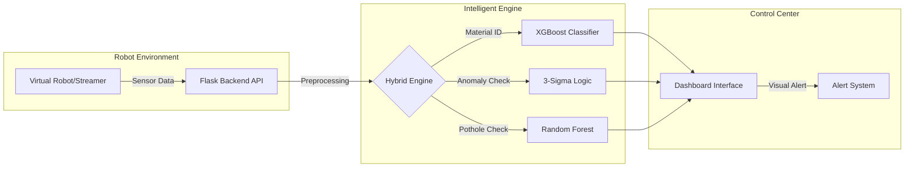

<b>그림 1: 실시간 노면 관제 시스템 웹 구성도</b>

---

## **3. 실외 포트홀 탐지 시스템**

### **3.1 데이터 전처리 및 데이터셋 최적화 (D1-D5)**
실외 데이터는 주행 속도에 따른 진동 크기 변화와 클래스 불균형 문제를 해결하기 위해 5단계에 걸친 데이터셋 최적화를 수행하였다. 물리 법칙에 따라 동일한 포트홀이라도 고속 주행 시 충격량이 더 크게 발생하므로 수직 가속도를 평균 속도로 나누는 속도 정규화 작업을 수행하여 속도 편향을 제거하였다.

| 버전 | 데이터셋 구성 | 주요 특징 및 적용 기술 | 레이블 임계값 | 특징 수 |
| :--- | :--- | :--- | :--- | :--- |
| D1 | Baseline | 기본 가속도 통계량, 20-step 윈도우 기반 | 0.15 | 11 |
| D2 | +Freq | Skew, Kurtosis, Peak Count 등 주파수 도메인 특징 추가 | 0.15 | 17 |
| D3 | +Fusion | Jerk, RMS, 속도 정규화(Speed Fusion) 특징 추가 | 0.15 | 28 |
| D4 | +Filter | D3에서 상관계수 0.7 이상인 중복 특징 제거 (다중공선성 해소) | 0.15 | 19 |
| D5 | Final | D4 구성 + 레이블 임계값 상향(0.2)으로 노이즈 데이터 정제 | 0.20 | 19 |

표 1. 실외 포트홀 데이터셋 최적화 단계별 상세 구성

데이터셋 최적화 단계는 D1 버전의 기본 가속도 통계량에서 시작하여 D2에서 주파수 도메인 특징을 보강하였다. 이후 D3에서 속도 정규화 특징을 융합하고 D4에서 상관계수 필터링을 통해 다중공선성을 해소하였다. 최종 D5 버전은 레이블 임계값을 상향 조정하여 노이즈를 정제한 완성형 데이터셋이다.

  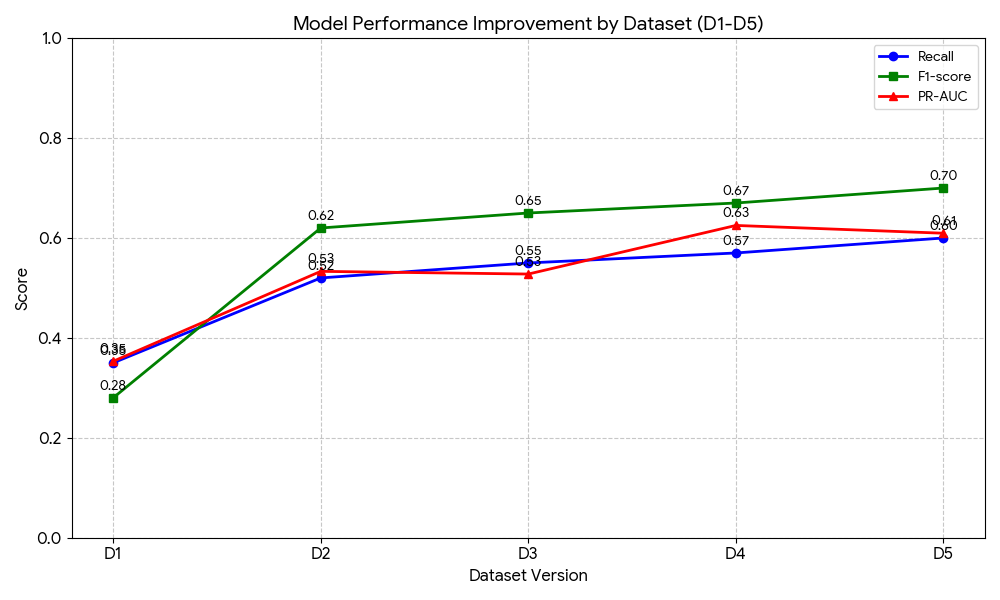

<b>그림 2: 데이터셋 최적화 단계(D1-D5)에 따른 모델 성능 향상 추이</b>

### **3.2 모델링 및 성능 고도화 (Model Evolution)**
실시간 관제 시스템의 핵심 평가지표로 재현율(Recall)을 선정하였다. 이는 도로 위 안전 사고 예방을 위해 포트홀 미탐지를 방지하는 것이 오탐지보다 훨씬 치명적이기 때문이다. 모든 모델은 Base, Imbalance, Final의 3단계 고도화를 거쳤다.

#### **1) 선형 및 커널 기반 모델 (Logistic Regression, SVM)**
선형 기반 모델들은 초기 재현율이 매우 낮았으나, 불균형 처리 전략 적용 시 성능이 급격히 개선되었다. Logistic Regression은 불균형 처리 적용 시 재현율이 0.340에서 0.810으로 급상승하며 미탐지 문제를 일차적으로 해결하였다. SVM은 클래스 가중치 최적화를 통해 재현율을 0.550에서 0.780으로 끌어올리며 탐지 성능의 안정성을 확보하였다.

  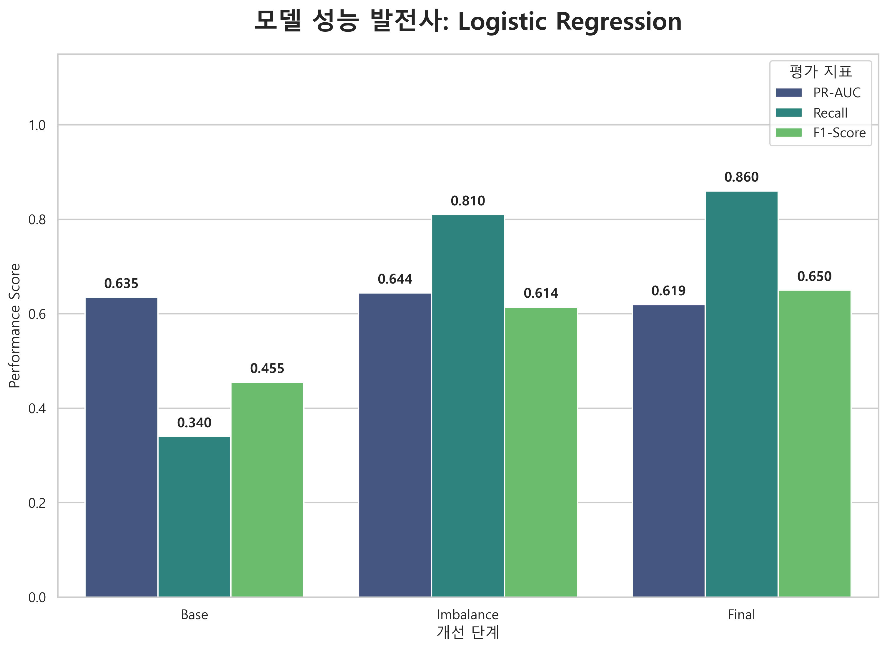
  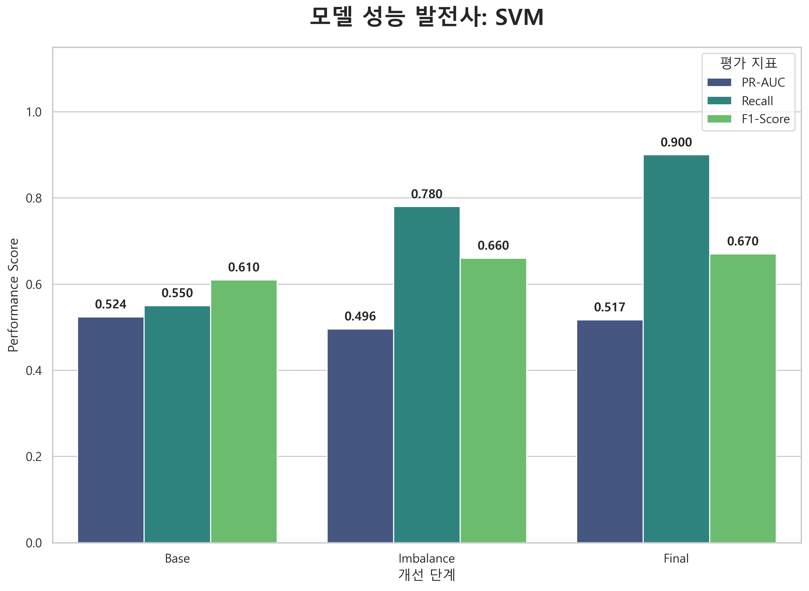

#### **2) 트리 기반 앙상블 모델 (Random Forest, XGBoost)**
앙상블 모델들은 복잡한 비선형 패턴 학습에 강점을 보였으며, 특히 Random Forest가 가장 우수한 성장을 나타냈다. Random Forest는 최종 단계에서 재현율이 0.810에서 0.930으로 대폭 상승하였으며, 탐지 신뢰도를 나타내는 PR-AUC 역시 0.678로 가장 안정적인 성능을 보였다. XGBoost는 베이스라인 성능은 우수했으나, 불균형 처리 및 튜닝 과정에서 오히려 재현율이 일부 감소(0.828 → 0.741)하는 과적합 양상이 관찰되어 최종 선정에서 제외되었다.

  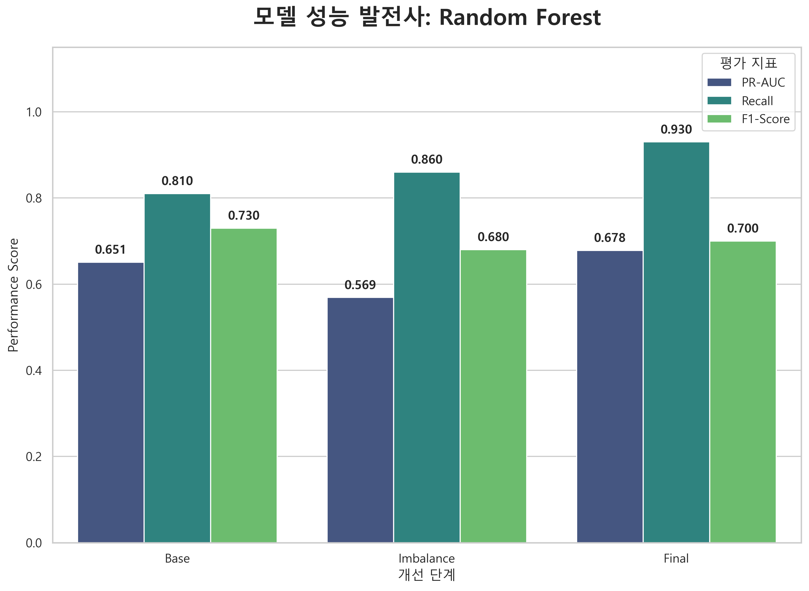
  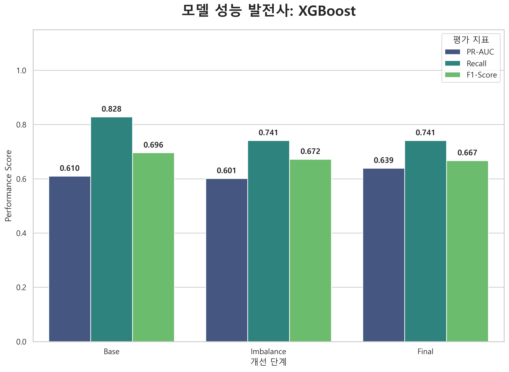

<b>그림 3: 주요 모델별 고도화 단계(Base → Imbalance → Final)에 따른 지표 변화 분석</b>

### **3.3 최종 모델 선정 및 효율성 평가**
실외 포트홀 탐지 시스템은 안전과 직결되므로 실제 결함을 놓치지 않는 재현율을 최우선 선정 기준으로 삼았다. 이에 따라 모든 모델 중 가장 우수한 탐지 능력을 보인 Random Forest를 최종 엔진으로 선정하였다.

최종 모델은 재현율 0.930을 기록하여 미탐지 위험을 최소화하였으며, PR-AUC 지표에서도 0.678을 기록하여 오탐지와 미탐지 사이의 균형이 뛰어남을 입증하였다. 또한 추론 지연 시간 12.56 ms를 달성하여 60km/h 주행 환경에서도 약 20cm 이동 거리 내에 감지 및 알람 처리가 가능하여 실시간 대응력을 확보하였다.

  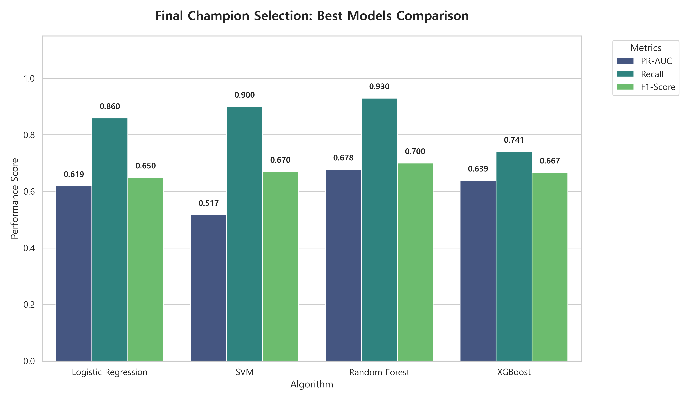
  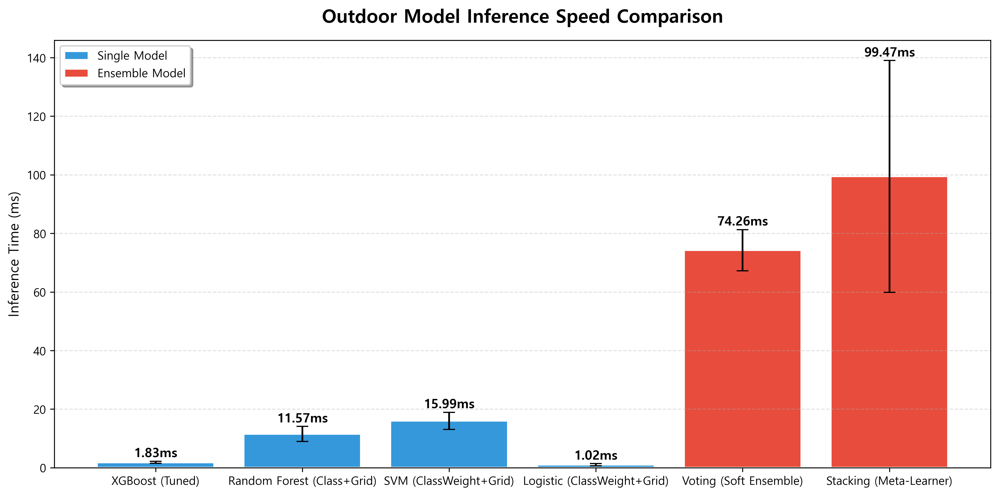
  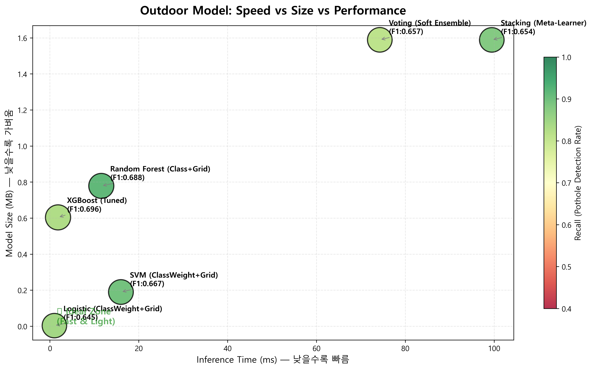

<b>그림 4: 실외 모델 최종 선정 및 추론 효율성 종합 분석</b>

---

## **4. 실내 노면 상태 인지 시스템**

### **4.1 분석 방법론 및 전처리**
실내 시스템은 쿼터니언 데이터를 Roll, Pitch, Yaw로 변환하여 물리적 직관성을 확보하고 다중공선성을 해소하였다. 128-Step 윈도우 기반으로 8종의 통계량을 산출하여 노면별 고유 진동 패턴을 정량화하였으며, 머신러닝 분류와 별도로 통계적 범위를 벗어나는 충격을 즉각 감지하기 위한 3-Sigma 이상 탐지 기법을 도입하였다.

  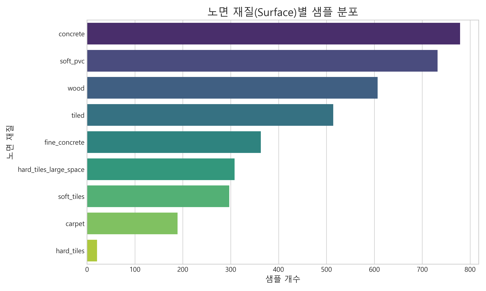
  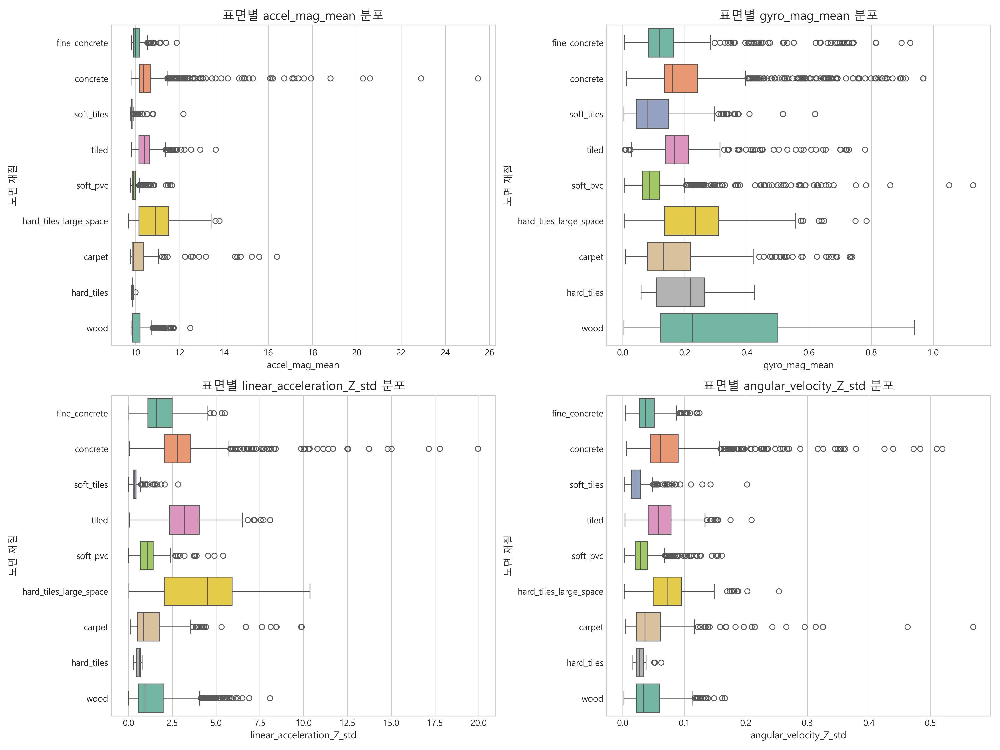
  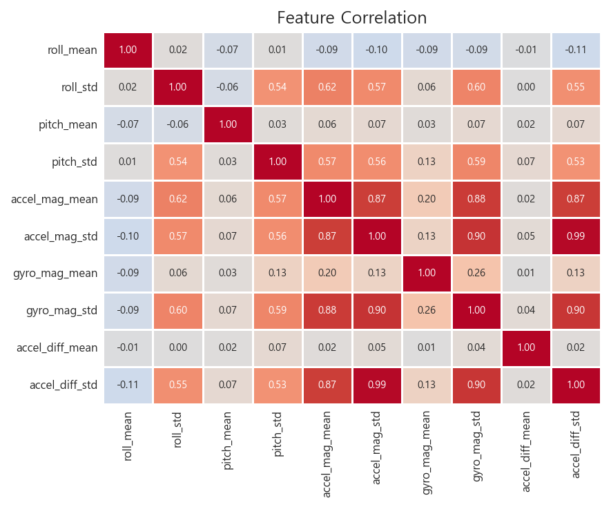

<b>그림 5: 실내 데이터 분포 및 특징별 상관관계 분석</b>

### **4.2 모델링 및 성능 고도화**
실내 환경은 9가지 노면 재질을 균형 있게 구분해야 하므로 Macro F1-Score와 경량화 성능을 동시에 고려하였다. 클래스 불균형 문제를 해결하기 위해 Class Weighting 및 SMOTE 전략을 비교 분석하여 최적의 학습 안정성을 확보하였다.

  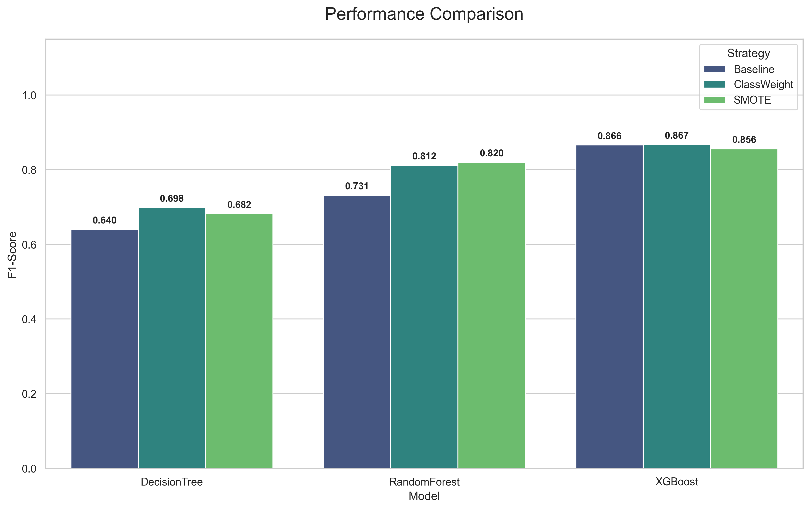
  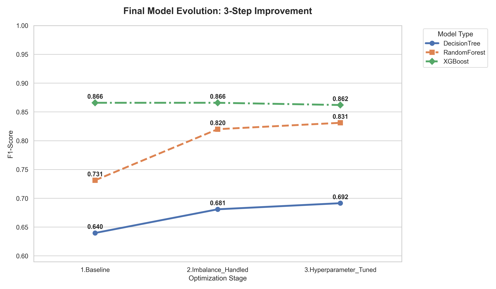

<b>그림 6: 실내 모델 불균형 해소 전략 비교 및 고도화 단계별 성능 추이</b>

### **4.3 최종 성능 및 효율성 평가**
실내 노면 인지 시스템은 재질별 분류 균형을 위해 Macro F1-Score를 핵심 선정 지표로 활용하였다. 최종적으로 F1-Score가 우수하면서도 실시간성이 극대화된 XGBoost Base 모델을 선정하였다.

| 지표 | XGBoost Base (최종) | XGBoost Tuned | 비고 |
| :--- | :--- | :--- | :--- |
| Macro F1-Score | 0.8659 | 0.8661 | 선정 기준: F1 균형 우수 |
| 추론 속도 (Latency) | 2.40 ms | 20.50 ms | 약 8.5배 속도 우위 |
| 모델 크기 (Size) | 1.36 MB | 9.36 MB | 엣지 디바이스 최적화 달성 |

표 2. 실내 모델 최종 성능 지표 상세 비교

XGBoost Base 모델은 Macro F1-Score 0.8659를 달성하여 튜닝 버전과 대등한 성능을 보였으며, 추론 속도 면에서 2.40 ms를 기록하여 약 8.5배의 속도 우위를 점하였다. 또한 모델 크기가 1.36 MB로 경량화되어 엣지 디바이스 최적화를 달성하였다.

  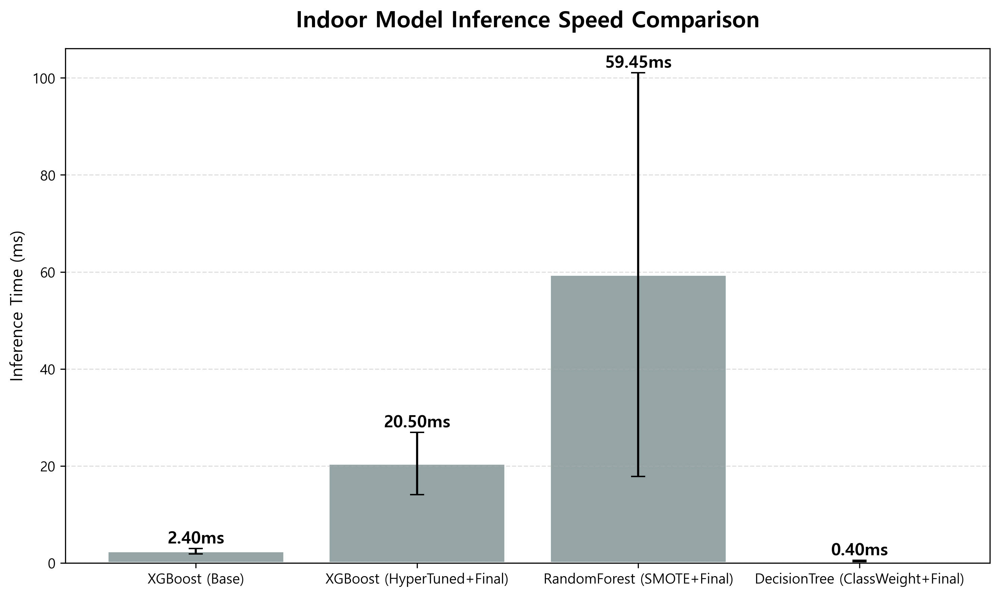
  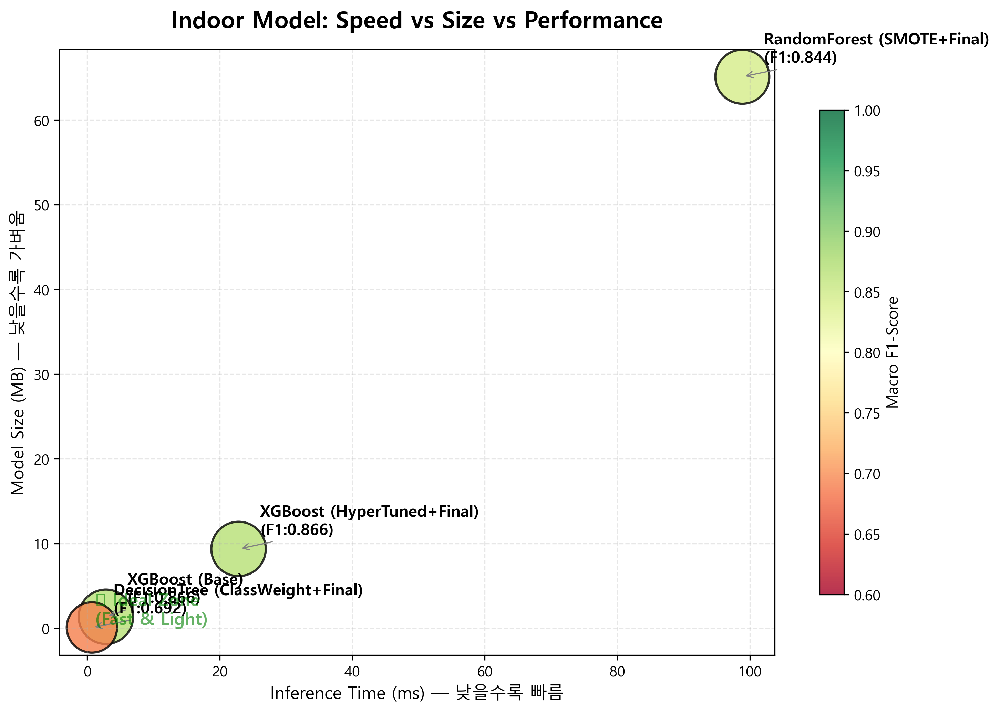

<b>그림 7: 실내 모델 추론 속도 및 종합 효율성 분석</b>

---

## **5. 실시간 웹 관제 대시보드**
개발된 엔진을 기반으로 운영자가 노면 상태를 즉각 파악할 수 있는 다크 모드 UI를 구현하였다. 대시보드는 실시간 센서 데이터 모니터링, 노면 재질 매핑, 지능형 경보 시스템 기능을 포함하며 이상 발생 시 시각적 알람을 제공한다.

  

<b>그림 8: 실시간 노면 상태 관제 대시보드 인터페이스</b>

---

## **6. 결론 (Conclusion)**
본 연구는 스마트 모빌리티의 안전 주행을 위한 통합 노면 인지 시스템을 구축하였다. 실외 탐지에서는 Random Forest 모델을 통해 0.930의 재현율을 확보하여 안전성을 극대화하였고, 실내 인지에서는 XGBoost 모델로 2.40ms의 초고속 추론과 86.6%의 정확도를 달성하여 시스템 효율성을 증명하였다. 향후에는 센서 데이터와 카메라 영상을 결합한 멀티모달 기반 고도화와 엣지 컴퓨팅 기기 최적화를 추진할 예정이다.

---

## **7. 참고문헌 (References)**
1. Eriksson, J., et al. (2008). The Pothole Patrol.
2. Efficient Pothole Detection using Smartphone Sensors. (2022).
3. Real-Time Road Surface Material Classification. (2023).
4. CareerCon 2019 - Help Navigating Robots. (2019).
