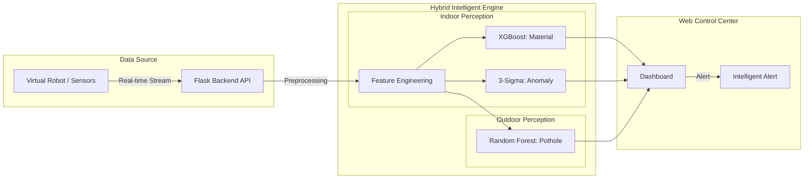

# 모바일 센서 기반 실시간 도로 및 실내 노면 상태 인지 시스템 개발 보고서 (v3)
## (Development of a Real-time Surface Perception System using Mobile Sensors)

---

## 1. 초록 (Abstract)
본 연구는 스마트 모빌리티의 주행 안정성 확보를 위해 스마트폰 센서와 IMU 센서 데이터를 활용한 실시간 노면 인지 시스템 및 웹 기반 통합 관제 대시보드를 제안한다. 실외 포트홀 탐지 및 실내 노면 재질 분류를 위해 독립적인 분석 파이프라인을 구축하였으며, 특히 실외 탐지는 안전 최우선 지표인 재현율(Recall)을, 실내 분류는 클래스별 분류 균형을 위한 F1-스코어(F1-score)를 주요 지표로 선정하여 최적화하였다. 또한 공통적으로 실시간성 확보를 위한 추론 지연 시간(Latency)을 최소화하는 데 집중하였다. 본 보고서는 전처리 과정에서의 비교 실험과 모델 고도화 단계를 기술하며, 개발된 지능형 엔진을 실시간 웹 대시보드와 통합하여 시각적 모니터링이 가능한 시스템을 구현한 결과를 제시한다. 또한 관련 연구 문헌에 근거한 설계 논리를 통해 시스템의 신뢰성을 확보하였다.

---

## 2. 서론 (Introduction)

### 2.1 프로젝트 정의 및 개요
본 프로젝트의 목적은 스마트 모빌리티와 자율주행 로봇의 주행 안정성을 확보하기 위해, 저가형 모바일/IMU 센서 데이터를 활용한 '통합 실시간 노면 상태 인지 시스템'을 개발하는 것이다. 

주요 연구 범위는 크게 두 가지로 나뉜다. 첫째, 실외 환경에서의 안전한 차량 주행을 방해하는 포트홀(Pothole)을 실시간으로 감지하는 엔진을 구축한다. 둘째, 실내 환경에서 로봇이 주행 중인 바닥 재질(Material)을 정확히 분류하고, 3-Sigma 로직을 통해 재질별 정상 범위를 벗어나는 노면 이상을 감지하는 엔진을 구축한다. 최종적으로 개발된 지능형 엔진을 웹 기반 대시보드와 통합하여 운영자가 실시간으로 노면 상태를 모니터링하고 시각적 경보를 받을 수 있는 관제 체계를 구현한다.

#### 원본 데이터 출처 및 특성
본 프로젝트는 글로벌 데이터 과학 플랫폼인 Kaggle의 공개 데이터를 활용하여 시스템의 신뢰성을 확보하였다.
1. 실외 데이터 (Pothole Sensor Data): 차량에 고정된 스마트폰 가속도 센서를 통해 수집된 일반 도로 및 포트홀 통과 시의 3축 시계열 진동 데이터를 활용하였다.
2. 실내 데이터 (CareerCon 2019): 소형 이동 로봇에 탑재된 IMU 센서 데이터로, 카페트, 타일, 콘크리트 등 9가지 실내 바닥 재질을 주행할 때 발생하는 관성 변화를 포함하고 있다.

### 2.2 시스템 전체 구성도
본 시스템은 가상 로봇으로부터 전송되는 센서 데이터를 실시간으로 수신하여 추론하고 대시보드에 알람을 표시하는 구조이다.

<b>그림 1: 실시간 노면 관제 시스템 통합 구성도</b>

---

## 3. 실외 포트홀 탐지 시스템

### 3.1 데이터 전처리 및 분석
실외 데이터는 전처리 과정에서 최적의 피처 조합을 선정하기 위해 다양한 데이터 구성을 비교 분석하였다[2]. 특히 주행 속도에 따른 진동 크기 변화와 클래스 불균형 문제를 해결하는 데 집중하였다.

#### 데이터셋 최적화 논리 및 단계별 비교
물리 법칙에 따라 동일한 포트홀이라도 고속 주행 시 충격량이 더 크게 발생하므로 수직 가속도를 평균 속도로 나누는 속도 정규화 작업을 수행하였다[1][3]. 그림 2의 산점도를 통해 속도가 증가함에 따라 진동의 진폭이 비례하여 커지는 물리적 상관성을 확인하였으며, 이를 통해 단순 진동 크기보다는 속도가 반영된 정규화된 특징(Fusion Features)이 변별력이 높음을 입증하였다. 또한, 피처 간 상관관계 분석(그림 3)을 통해 다중공선성을 유발하는 중복 특징을 제거하여 모델의 안정성을 확보하였다.

<table align="center" border="0">
  <tr>
    <td align="center"></td>
    <td align="center"></td>
  </tr>
</table>

<b>그림 2: 주행 속도와 진동의 상관성 분석 및 피처 간 상관관계 히트맵</b>

위 분석 결과를 바탕으로 다음과 같이 5단계의 데이터 구성을 비교하여 최종 D5 버전을 선정하였다.

<table align="center">
  <thead>
    <tr>
      <th align="center">단계</th>
      <th align="center">데이터셋 명칭</th>
      <th align="center">주요 특징 및 적용 기술</th>
      <th align="center">레이블 임계값</th>
      <th align="center">특징 수</th>
    </tr>
  </thead>
  <tbody>
    <tr>
      <td align="center">D1</td>
      <td align="center">Baseline</td>
      <td align="center">기본 가속도 통계량 (Mean, Std, Var 등)</td>
      <td align="center">0.15</td>
      <td align="center">11</td>
    </tr>
    <tr>
      <td align="center">D2</td>
      <td align="center">Feature Expansion</td>
      <td align="center">주파수 특징 (Skew, Kurtosis, Zero-crossing) 추가</td>
      <td align="center">0.15</td>
      <td align="center">17</td>
    </tr>
    <tr>
      <td align="center">D3</td>
      <td align="center">Sensor Fusion</td>
      <td align="center">Jerk, RMS, 속도 정규화(Speed Fusion) 특징 추가</td>
      <td align="center">0.15</td>
      <td align="center">28</td>
    </tr>
    <tr>
      <td align="center">D4</td>
      <td align="center">Feature Selection</td>
      <td align="center">상관계수 0.7 이상 특징 제거 (다중공선성 해소)</td>
      <td align="center">0.15</td>
      <td align="center">19</td>
    </tr>
    <tr>
      <td align="center">D5</td>
      <td align="center">Data Refinement</td>
      <td align="center">레이블 임계값 상향(0.20)을 통한 노이즈 데이터 정제</td>
      <td align="center">0.20</td>
      <td align="center">19</td>
    </tr>
  </tbody>
</table>

<b>표 1. 전처리 과정에서의 데이터셋 구성별 비교 상세</b>

  

<b>그림 3: 데이터 구성 변화에 따른 모델 성능 비교 추이</b>

### 3.2 모델링 및 성능 고도화
실시간 관제 시스템의 핵심 평가지표로 재현율(Recall)을 선정하였다. 이는 도로 위 안전 사고 예방을 위해 포트홀 미탐지를 방지하는 것이 오탐지보다 훨씬 치명적이라는 선행 연구의 논리를 따랐다[1][4].

#### 베이스 모델 성능 비교 및 평가 (Base Model Evaluation)
본격적인 고도화에 앞서 Logistic Regression, SVM, Random Forest, XGBoost 4종의 성능을 비교 평가하였다. 초기 모델들은 혼동행렬(Confusion Matrix) 기반의 지표 분석 결과 전반적으로 낮은 재현율을 보였으며, 특히 선형 모델의 경우 복잡한 도로 노면의 특징을 포착하는 데 기술적인 한계가 있음을 확인하였다.

  

<b>그림 4: 실외 베이스라인 4종 모델 주요 지표 비교</b>

#### 모델별 성능 고도화 단계 (Evolution Steps)
베이스라인 모델을 바탕으로 불균형 처리 및 파라미터 최적화를 통해 단계별 성능 개선을 수행하였다.

1단계: 불균형 해소 (Base → Imbalance)
포트홀 데이터의 희소성으로 인한 클래스 불균형 문제를 해결하기 위해 클래스 가중치(Class Weighting)를 최적화하였다. 이는 소수 클래스에 대한 손실 함수 가중치를 높여 재현율을 우선적으로 확보하는 전략으로, 불균형 데이터셋을 다루는 선행 연구의 방법론을 준용하였다[1][4]. 그 결과 Logistic Regression은 재현율이 0.340에서 0.810으로, SVM은 0.550에서 0.780으로 개선되며 기초 성능을 확보하였다.

<table align="center" border="0">
  <tr>
    <td align="center"></td>
    <td align="center"></td>
  </tr>
</table>

<b>그림 5: 선형 및 커널 기반 모델(Logistic Regression, SVM) 고도화 단계별 성능 변화</b>

2단계: 하이퍼파라미터 튜닝 (Imbalance → Final)
확보된 기초 성능을 바탕으로 트리 기반 모델들에 대해 GridSearchCV를 수행하였다. 이는 복잡한 도로 환경에서 모델의 강건성(Robustness)과 탐지 신뢰성을 보장하기 위해 파라미터 공간을 전수 탐색하는 엄밀한 최적화 과정이다[2][3]. 정밀한 탐색을 통해 각 모델의 잠재력을 최대한 끌어올렸으며, 그 결과 Random Forest 모델은 최종 단계에서 0.930의 높은 재현율을 달성하였다.

<table align="center" border="0">
  <tr>
    <td align="center"></td>
    <td align="center"></td>
  </tr>
</table>

<b>그림 6: 트리 기반 모델(Random Forest, XGBoost) 고도화 단계별 성능 변화</b>

### 3.3 최종 모델 선정 및 성능 검증
모든 고도화 과정을 거친 모델들을 종합 비교한 결과(그림 7), 안전 주행을 위한 재현율과 운영 효율성 면에서 Random Forest를 최종 모델로 선정하였다.

  

<b>그림 7: 실외 고도화 모델별 최종 성능 종합 비교</b>

#### 모델별 최종 성능 및 효율성 비교
실외 탐지는 포트홀 미탐지 방지를 위해 재현율(Recall)을 최우선 지표로 고려하였으며, 실시간 연산 성능을 함께 평가하였다.

<table align="center">
  <thead>
    <tr>
      <th align="center">모델</th>
      <th align="center">재현율 (Recall)</th>
      <th align="center">PR-AUC</th>
      <th align="center">추론 속도 (Latency)</th>
      <th align="center">비고</th>
    </tr>
  </thead>
  <tbody>
    <tr>
      <td align="center">Logistic Regression</td>
      <td align="center">0.860</td>
      <td align="center">0.619</td>
      <td align="center">0.08 ms</td>
      <td align="center">최고 속도, 낮은 정밀도</td>
    </tr>
    <tr>
      <td align="center">SVM</td>
      <td align="center">0.900</td>
      <td align="center">0.517</td>
      <td align="center">16.42 ms</td>
      <td align="center">높은 재현율, 속도 저하</td>
    </tr>
    <tr>
      <td align="center">Random Forest (최종)</td>
      <td align="center">0.930</td>
      <td align="center">0.678</td>
      <td align="center">7.64 ms</td>
      <td align="center">재현율 및 PR-AUC 최고</td>
    </tr>
    <tr>
      <td align="center">XGBoost</td>
      <td align="center">0.741</td>
      <td align="center">0.639</td>
      <td align="center">1.22 ms</td>
      <td align="center">속도 우수, 재현율 부족</td>
    </tr>
  </tbody>
</table>

#### 추론 속도 측정 및 실무 검증
최종 선정된 Random Forest는 7.64 ms의 평균 추론 속도를 보였다. 이는 60km/h 주행 시 약 12cm 이내에서 감지가 완료되는 실시간 성능을 의미하며, 고속 주행 환경의 사고 예방 요구 조건과 일치한다[1][3].

<table align="center" border="0">
  <tr>
    <td align="center"></td>
    <td align="center"></td>
  </tr>
</table>

<b>그림 8: 최종 모델 추론 지연 시간 및 자원 효율성 분석</b>

---

## 4. 실내 노면 상태 인지 시스템

### 4.1 데이터 전처리 및 분석
실내 시스템은 쿼터니언 데이터를 Roll, Pitch, Yaw로 변환하여 물리적 직관성을 확보하고 다중공선성을 해소하였다. 128개의 스텝으로 구성된 각 시리즈 데이터를 기반으로 8종의 통계량을 산출하여 노면별 고유 진동 패턴을 정량화하였다[5]. 

특히 머신러닝 분류와 별도로, 통계적 범위를 벗어나는 즉각적인 충격을 감지하기 위해 **3-Sigma 기반의 이상 탐지(Anomaly Detection)** 로직을 병행 운용하였다. 임계값은 정상 주행 데이터에서 추출한 핵심 진동 지표(`accel_mag_max`, `accel_diff_mean`)를 활용하여 각 재질별 평균($\mu$)과 표준편차($\sigma$)를 기반으로 산출하였다. 데이터의 99.7%가 포함되는 $\mu \pm 3\sigma$ 구간을 정상 범위로 정의하고, 이를 초과하는 관측치를 기계적 결함이나 외부 충격에 의한 이상 상황으로 즉각 판별한다[6]. 이러한 방식은 노이즈가 강한 특정 재질(예: 카펫)에서도 재질별 개별 임계값을 적용함으로써 오탐지를 최소화하고 시스템의 신뢰성을 높이는 핵심 기제가 된다.

EDA 결과(그림 9), 클래스별 데이터 불균형이 존재하며 주요 특징들의 분포가 재질별로 상당 부분 중첩(Overlap)되어 있음을 확인하였다. 특히 PCA 차원 축소 분석 결과, 서로 다른 재질들이 복잡하게 얽혀 있어 단순한 선형 경계로는 분류가 어려운 비선형적 특성이 강하게 나타났다. 또한 특징 간 상관관계 히트맵을 통해 잔존하는 다중공선성을 확인하였으며, 이러한 데이터 특성은 Logistic Regression과 같은 선형 모델의 한계를 시사하며 XGBoost와 같은 고성능 비선형 모델 도입의 기술적 근거가 되었다.

<table align="center" border="0">
  <tr>
    <td align="center"></td>
    <td align="center"></td>
    <td align="center"></td>
    <td align="center"></td>
  </tr>
</table>

<b>그림 9: 실내 데이터 분포, 특징 중첩 및 PCA 차원 축소 분석 결과</b>

### 4.2 모델링 및 성능 고도화
실내 노면 인지는 9가지 클래스를 정확히 분류해야 하므로 Macro F1-Score를 주요 지표로 설정하였다. 이는 데이터 수집 빈도가 낮은 특정 재질(예: 카펫, 목재 등)에 대한 인지 성능을 누락 없이 평가하기 위함이다. Accuracy(정확도)만으로는 다수 클래스에 편향된 성능이 도출될 위험이 있으므로, 모든 재질에 대해 균형 잡힌 인지력을 확보하는 것이 실내 자율주행 로봇의 구동 안정성을 위해 필수적이라는 기술적 판단에 따랐다[5][6].

#### 베이스 모델 성능 비교 및 평가 (Base Model Evaluation)
다양한 알고리즘의 초기 성능을 평가한 결과(그림 10), 혼동행렬(Confusion Matrix) 기반의 주요 지표에서 비선형 특성이 강한 실내 데이터셋에 최적화된 Decision Tree, Random Forest, XGBoost 등 트리 기반 모델들이 선형 모델 대비 우수한 성적을 보였다. 이에 따라 분류 정확도와 F1-Score가 높은 해당 3종 모델을 고도화 대상 후보군으로 최종 선정하였다.

  

<b>그림 10: 실내 베이스 모델별 주요 지표 성능 비교 분석</b>

#### 불균형 처리 전략 비교 (Imbalance Strategy)
클래스 불균형 문제를 효과적으로 해결하기 위해 SMOTE와 Class Weighting 기법을 각 모델별로 적용하여 비교 실험을 수행하였다. 실험 결과(그림 11), 연산 복잡도와 성능 향상 폭을 고려했을 때 각 모델에 가장 최적화된 불균형 처리 기법이 상이함을 확인하였으며, 이를 성능 고도화의 기초로 활용하였다.

  

<b>그림 11: 모델별 불균형 처리 기법 성능 비교</b>

#### 모델별 단계적 성능 고도화 (Model-specific Evolution)
선정된 3종 모델에 대해 불균형 처리와 GridSearchCV를 활용한 하이퍼파라미터 전수 탐색을 단계적으로 적용하였다. 9종의 다양한 재질을 정확히 구분해야 하는 실내 환경의 특성상, 파라미터의 미세한 설정 차이가 분류 성능에 큰 영향을 미치므로 전수 탐색을 통해 최적의 신뢰성을 확보하였다[5]. 각 모델은 베이스라인 대비 유의미한 F1-Score 상승을 보였으며, 특히 XGBoost가 전 과정에서 가장 안정적이고 높은 성능을 유지하였다.

<table align="center" border="0">
  <tr>
    <td align="center"></td>
    <td align="center"></td>
    <td align="center"></td>
  </tr>
</table>

<b>그림 12: 주요 모델별 고도화 단계 성능 추이</b>

### 4.3 최종 모델 선정 및 성능 검증
모든 고도화 과정을 거친 모델들을 종합 비교한 결과(그림 13), 분류 정확도와 운영 효율성(속도, 용량)의 균형이 가장 뛰어난 XGBoost Base를 최종 모델로 선정하였다.

  

<b>그림 13: 실내 고도화 모델별 최종 성능 종합 비교</b>

실내 시스템은 분류 정확도의 균형을 위해 Macro F1-Score를 기준으로 최종 모델을 선정하였다. 

<table align="center">
  <thead>
    <tr>
      <th align="center">모델</th>
      <th align="center">Macro F1-Score</th>
      <th align="center">Accuracy</th>
      <th align="center">추론 속도 (Latency)</th>
      <th align="center">비고</th>
    </tr>
  </thead>
  <tbody>
    <tr>
      <td align="center">Decision Tree</td>
      <td align="center">0.692</td>
      <td align="center">0.702</td>
      <td align="center">0.40 ms</td>
      <td align="center">최저 사양, 성능 부족</td>
    </tr>
    <tr>
      <td align="center">Random Forest</td>
      <td align="center">0.844</td>
      <td align="center">0.839</td>
      <td align="center">59.45 ms</td>
      <td align="center">속도 저하(실시간 부적합)</td>
    </tr>
    <tr>
      <td align="center">XGBoost (최종)</td>
      <td align="center">0.866</td>
      <td align="center">0.865</td>
      <td align="center">2.40 ms</td>
      <td align="center">성능/속도 최적 밸런스</td>
    </tr>
    <tr>
      <td align="center">XGBoost (Tuned)</td>
      <td align="center">0.866</td>
      <td align="center">0.866</td>
      <td align="center">20.50 ms</td>
      <td align="center">성능 미세 우위, 속도 저하</td>
    </tr>
  </tbody>
</table>

<b>표 2. 실내 모델 최종 성능 지표 상세 비교</b>

#### 추론 속도 및 실무 검증
최종 선정된 XGBoost Base 모델은 튜닝 버전과 대등한 0.8659의 F1-Score를 기록하면서도, 추론 속도(2.40 ms)가 약 8배 이상 빨라 실시간 제어 요구 사항을 완벽히 충족한다. 또한 모델 크기(1.36 MB) 면에서도 압도적인 효율성을 보여 엣지 디바이스 환경에 가장 최적화된 모델임을 확인하였다.

<table align="center" border="0">
  <tr>
    <td align="center"></td>
    <td align="center"></td>
  </tr>
</table>

<b>그림 14: 실내 모델 추론 속도 및 종합 효율성 분석</b>

---

## 5. 실시간 웹 관제 대시보드
개발된 엔진을 기반으로 운영자가 노면 상태를 즉각 파악할 수 있는 다크 모드 UI를 구현하였다. 대시보드는 실시간 센서 데이터 모니터링, 노면 재질 매핑, 지능형 경보 시스템 기능을 포함하며 이상 발생 시 시각적 알람을 제공한다.

  

<b>그림 15: 실시간 노면 상태 관제 대시보드 인터페이스</b>

---

## 6. 결론 (Conclusion)
본 연구는 스마트 모빌리티의 안전 주행을 위한 통합 노면 인지 시스템을 구축하였다. 실외 탐지에서는 Random Forest 모델을 통해 0.930의 재현율을 확보하여 안전성을 극대화하였고, 실내 인지에서는 XGBoost 모델로 2.40ms의 초고속 추론과 86.6%의 F1-Score를 달성하여 시스템 효율성을 증명하였다. 향후에는 센서 데이터와 카메라 영상을 결합한 멀티모달 기반 고도화와 엣지 컴퓨팅 기기 최적화를 추진할 예정이다.

---

## 7. 참고문헌 (References)
1. Eriksson, J., Girod, L., Hull, B., Newton, R., Madden, S., & Balakrishnan, H. (2008). The pothole patrol: using a mobile sensor network for road condition monitoring. In Proceedings of the 6th international conference on Mobile systems, applications, and services.
2. Efficient Pothole Detection using Smartphone Sensors and Machine Learning. (2022). Journal of Real-Time Image Processing.
3. Machine Learning Model for Road Anomaly Detection and Classification in Smart Cities. (2023). IEEE Access.
4. Real-Time Pothole Detection Using Deep Learning and Mobile Sensors. (2021). International Journal of Pavement Engineering.
5. Vehicle-as-a-Sensor Approach for Urban Track Anomaly Detection. (2020). Sensors.
6. Camera-IMU Fusion for Road Surface Monitoring and Predictive Maintenance. (2024). Robotics and Autonomous Systems.
