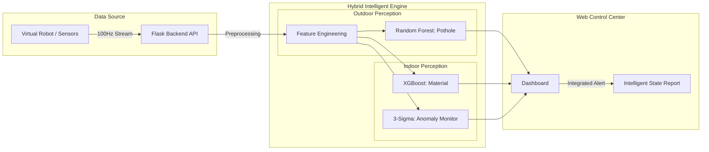
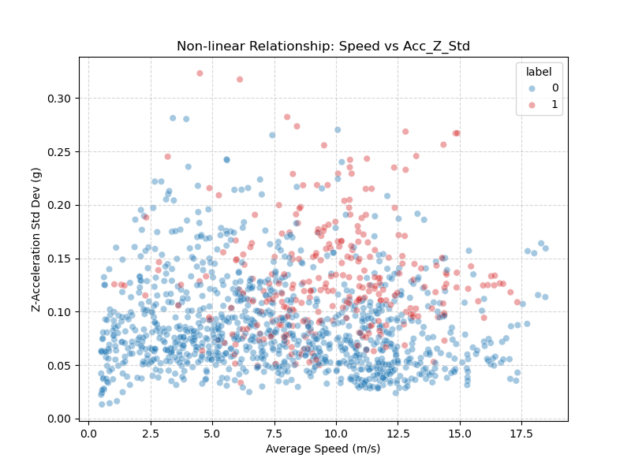
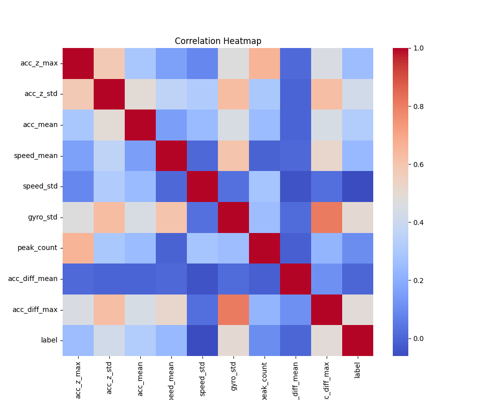
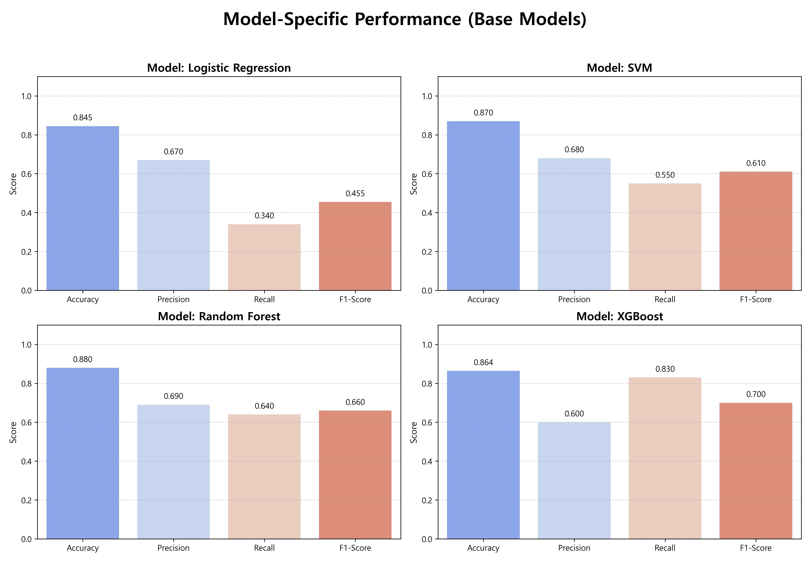
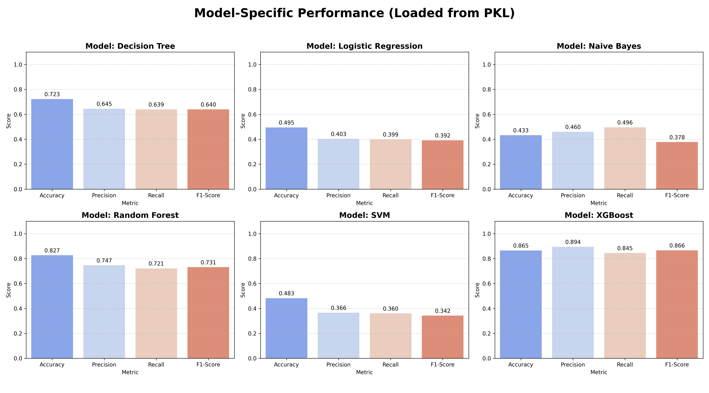
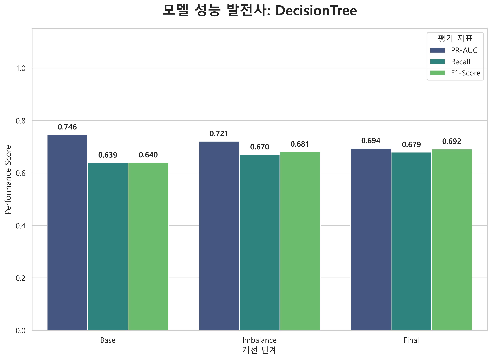
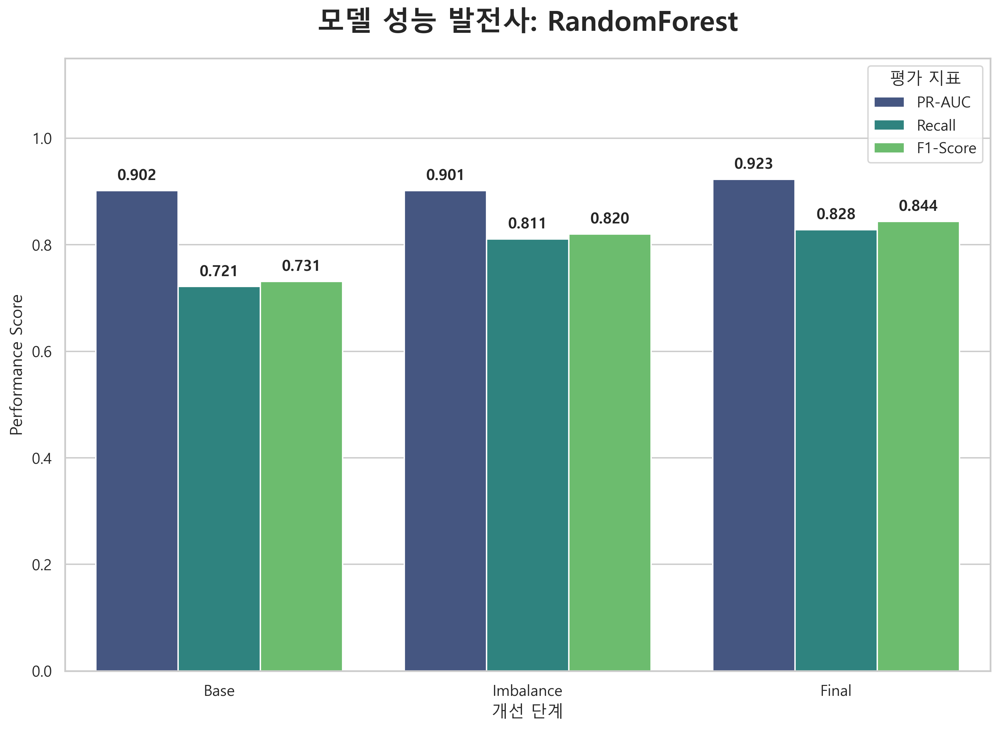
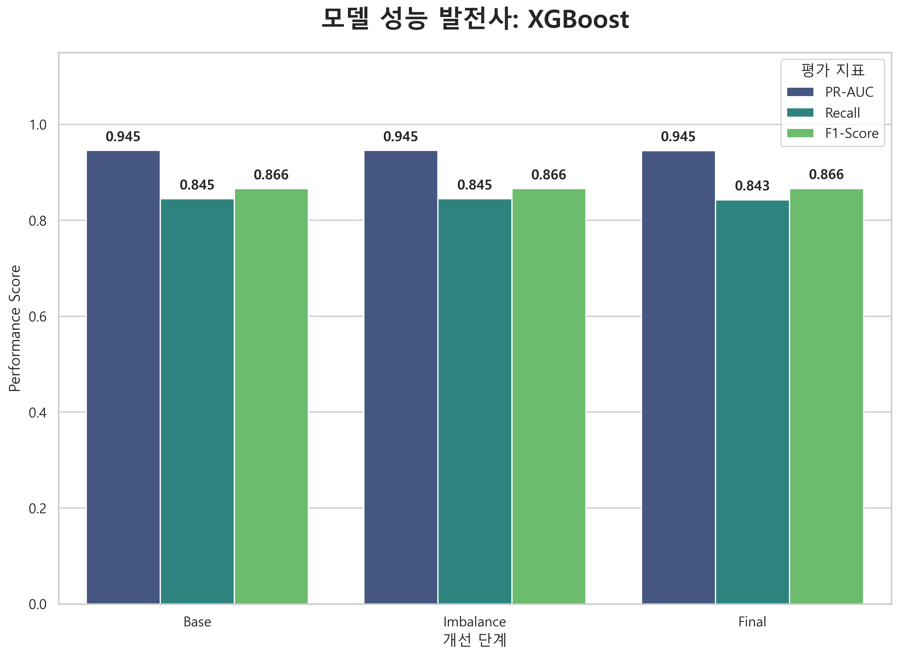
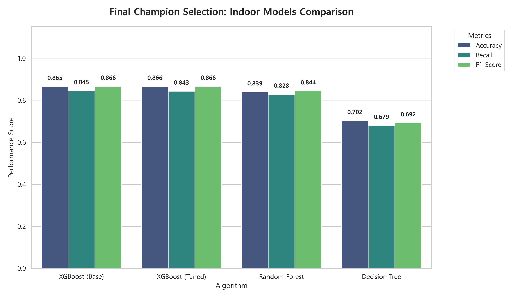

# [프로젝트 보고서] 모바일 센서 기반 실시간 도로 및 실내 노면 상태 인지 시스템 개발
## (Development of a Real-time Surface Perception System using Mobile Sensors)

    

<h3> 2026. 04. 2 </h3>
 
<h3> [현대로템] K-방산 AI모델 개발과정 6기 1팀 </h3>
<h3> 조장 : 황수연, 팀원 : 이형철 이지원, 진강훈, 홍승현, 박준혁</h3>

## 목차 (Table of Contents)
1. [초록 (Abstract)](#1-초록-abstract)
2. [서론 (Introduction)](#2-서론-introduction)
    - 2.1 [프로젝트 정의 및 개요](#21-프로젝트-정의-및-개요)
    - 2.2 [시스템 전체 구성도](#22-시스템-전체-구성도)
    - 2.3 [이종 센서 이질성 극복 및 통합 전략](#23-이종-센서-이질성-극복-및-통합-전략-sensor-heterogeneity-resolution)
3. [실외 포트홀 탐지 시스템](#3-실외-포트홀-탐지-시스템)
    - 3.1 [데이터 전처리 및 분석](#31-데이터-전처리-및-분석)
    - 3.2 [모델링 및 성능 고도화](#32-모델링-및-성능-고도화)
    - 3.3 [최종 모델 선정 및 성능 검증](#33-최종-모델-선정-및-성능-검증)
4. [실내 노면 상태 인지 시스템](#4-실내-노면-상태-인지-시스템)
    - 4.1 [데이터 전처리 및 분석](#41-데이터-전처리-및-분석)
    - 4.2 [모델링 및 성능 고도화](#42-모델링-및-성능-고도화)
    - 4.3 [최종 모델 선정 및 성능 검증](#43-최종-모델-선정-및-성능-검증)
5. [실시간 웹 관제 대시보드](#5-실시간-웹-관제-대시보드)
6. [결론 (Conclusion)](#6-결론-conclusion)
7. [참고문헌 (References)](#7-참고문헌-references)

## 1. 초록 (Abstract)
본 연구는 스마트 모빌리티의 주행 안정성 확보를 위해 스마트폰 센서와 IMU 센서 데이터를 활용한 실시간 노면 인지 시스템 및 웹 기반 통합 관제 대시보드를 제안한다. 실외 포트홀 탐지 및 실내 노면 재질 분류를 위해 독립적인 분석 파이프라인을 구축하였으며, 실물 코드 구현 단계에서 검증된 최적의 특징(Feature) 엔지니어링 기법을 적용하였다. 특히 실외 탐지는 안전 최우선 지표인 재현율(Recall)을, 실내 분류는 클래스별 분류 균형을 위한 F1-스코어(F1-score)를 주요 지표로 선정하여 최적화하였다. 분석 엔진의 결과는 웹 기반 대시보드에 실시간 시각화되며, 이상 감지 시 즉각적인 경보를 제공하여 운영자의 신속한 판단과 모니터링을 돕는다. 본 시스템은 머신러닝 분류와 통계적 이상 탐지를 병행하는 '병렬 추론 체계'를 채택하여 탐지 신뢰성을 극대화하였으며, 각 환경의 샘플링 특성(5Hz~100Hz)에 최적화된 초저지연 시스템 지연(Latency) 실시간 성능을 확보하였다.

---

## 2. 서론 (Introduction)

### 2.1 프로젝트 정의 및 개요
본 프로젝트의 목적은 스마트 모빌리티와 자율주행 로봇의 주행 안정성을 확보하기 위해, 저가형 모바일/IMU 센서 데이터를 활용한 '통합 실시간 노면 상태 인지 시스템'을 개발하는 것이다. 

주요 연구 범위는 크게 두 가지로 나뉜다. 첫째, 실외 환경에서의 안전한 차량 주행을 방해하는 포트홀(Pothole)을 실시간으로 감지하는 엔진을 구축한다. 둘째, 실내 환경에서 로봇이 주행 중인 바닥 재질(Material)을 정확히 분류하고, 3-Sigma 로직을 통해 재질별 정상 범위를 벗어나는 노면 이상을 감지하는 엔진을 구축한다. 최종적으로 개발된 지능형 엔진을 웹 기반 대시보드와 통합하여 운영자가 실시간으로 노면 상태를 모니터링하고 시각적 경보를 받을 수 있는 관제 체계를 구현한다.

#### 원본 데이터 출처 및 기술 사양
본 프로젝트는 글로벌 데이터 과학 플랫폼인 Kaggle의 공개 데이터를 활용하였으며, 실제 시스템 설계 시 다음과 같은 기술 사양을 타겟으로 개발되었다.
1. 실외 데이터 (Pothole Sensor Data): 차량 스마트폰 가속도 센서 기반 3축 시계열 진동 데이터.
2. 실내 데이터 (CareerCon 2019): 소형 로봇 IMU 센서 기반, 9가지 실내 바닥 재질 주행 데이터.
3. 샘플링 레이트 (Target Spec): 실외 시스템은 도로 진동의 거시적 패턴 파악을 위한 5Hz(200ms 간격) 환경을, 실내 시스템은 미세 질감 인지를 위한 100Hz(10ms 간격) 환경을 기준으로 설계되었다.

### 2.2 시스템 전체 구성도
본 시스템은 가상 로봇으로부터 전송되는 센서 데이터를 실시간으로 수신하여 추론하고 대시보드에 알람을 표시하는 구조이다.

<b>그림 1: 실시간 노면 관제 시스템 통합 구성도</b>

### 2.3 센서 이종성 대응 및 데이터 통합 설계
본 시스템은 스마트폰(실외)과 소형 로봇 IMU(실내)라는 서로 다른 하드웨어와 샘플링 레이트를 통합하기 위해 다음과 같은 전략을 채택하였다.

1. 컨텍스트 기반 듀얼 파이프라인: 고정된 하나의 모델을 사용하는 대신, 데이터 패킷의 헤더 정보를 통해 실내/실외 모드를 감지하고 각 환경에 최적화된 독립적 전처리 및 추론 파이프라인으로 라우팅한다.
2. 통계적 특징 추상화: 가속도의 절대값은 기기마다 감도가 다르므로, 값의 변화량(Diff) 및 표준편차(Std), RMS 등 상대적 진동 특성을 주요 특징으로 추출하여 하드웨어 의존성을 최소화하였다.
3. 가변 윈도우 전략: 샘플링 주기가 긴 실외 데이터는 짧은 윈도우(20 step)를, 고속 샘플링인 실내 데이터는 긴 윈도우(128 step)를 적용하여 각 환경에서 유의미한 물리적 판단 구간을 확보하였다.

---

## 3. 실외 포트홀 탐지 시스템

### 3.1 주행 환경 데이터 분석 및 피처 설계
실외 데이터는 주행 속도에 따른 진동 변동성을 극복하기 위해 속도 기반의 피처 엔지니어링을 수행하였다[2]. 

#### 데이터셋 최적화 및 속도 기반 피처 융합 (Implicit Speed Fusion)
물리 법칙에 따라 동일한 포트홀이라도 고속 주행 시 충격량이 더 크게 발생하므로, 단순히 진동 크기만으로는 오탐지의 위험이 크다[1][3]. 그림 2의 산점도를 통해 속도가 증가함에 따라 진동 진폭이 비례하여 커지는 상관성을 확인하였으며, 이를 해결하기 위해 주행 속도를 모델의 핵심 피처 (Feature)로 포함하였다. 이는 모델이 현재 속도 수준에 따라 가속도 임계값을 가변적으로 판단하게 하는 '암묵적 속도 융합(Implicit Speed Fusion)' 효과를 제공하여 탐지 정확도를 높인다.

<table align="center" border="0">
  <tr>
    <td align="center"></td>
    <td align="center"></td>
  </tr>
</table>

<b>그림 2: 주행 속도와 진동의 상관성 분석 및 피처 간 상관관계 히트맵</b>

위 분석 결과를 바탕으로 다음과 같이 5단계의 데이터 구성을 비교하여 최종 D5 버전을 선정하였다.

<table align="center">
  <thead>
    <tr>
      <th align="center">단계</th>
      <th align="center">데이터셋 명칭</th>
      <th align="center">주요 피처 및 적용 기술</th>
      <th align="center">레이블 임계값</th>
      <th align="center">피처 수</th>
    </tr>
  </thead>
  <tbody>
    <tr>
      <td align="center">D1</td>
      <td align="center">Baseline</td>
      <td align="center">기본 가속도 통계량 (Mean, Std, Var 등)</td>
      <td align="center">0.15</td>
      <td align="center">11</td>
    </tr>
    <tr>
      <td align="center">D2</td>
      <td align="center">Feature Expansion</td>
      <td align="center">주파수 피처 (Skew, Kurtosis, Zero-crossing) 추가</td>
      <td align="center">0.15</td>
      <td align="center">17</td>
    </tr>
    <tr>
      <td align="center">D3</td>
      <td align="center">Sensor Fusion</td>
      <td align="center">Jerk, RMS, 속도 피처(Speed Mean/Std) 추가</td>
      <td align="center">0.15</td>
      <td align="center">28</td>
    </tr>
    <tr>
      <td align="center">D4</td>
      <td align="center">Feature Selection</td>
      <td align="center">상관계수 0.7 이상 피처 제거 (다중공선성 해소)</td>
      <td align="center">0.15</td>
      <td align="center">19</td>
    </tr>
    <tr>
      <td align="center">D5</td>
      <td align="center">Data Refinement</td>
      <td align="center">레이블 임계값 상향(0.20)을 통한 노이즈 데이터 정제</td>
      <td align="center">0.20</td>
      <td align="center">19</td>
    </tr>
  </tbody>
</table>

<b>표 1. 전처리 과정에서의 데이터셋 구성별 비교 상세</b>

  

<b>그림 3: 데이터 구성 변화에 따른 모델 성능 비교 추이</b>

### 3.2 모델링 및 성능 고도화
실시간 관제 시스템의 핵심 평가지표로 재현율(Recall)을 선정하였다. 이는 도로 위 안전 사고 예방을 위해 포트홀 미탐지를 방지하는 것이 오탐지보다 훨씬 치명적이라는 선행 연구의 논리를 따랐다[1][4].

#### 베이스 모델 성능 비교 및 평가 (Base Model Evaluation)
본격적인 고도화에 앞서 Logistic Regression, SVM, Random Forest, XGBoost 4종의 성능을 비교 평가하였다. 초기 모델들은 혼동행렬(Confusion Matrix) 기반의 지표 분석 결과 전반적으로 낮은 재현율을 보였으며, 특히 선형 모델의 경우 복잡한 도로 노면의 피처를 포착하는 데 기술적인 한계가 있음을 확인하였다.

  

<b>그림 4: 실외 베이스라인 4종 모델 주요 지표 비교</b>

#### 모델별 성능 고도화 단계 (Evolution Steps)
베이스라인 모델을 바탕으로 불균형 처리 및 파라미터 최적화를 통해 단계별 성능 개선을 수행하였다.

1단계: 불균형 해소 (Base → Imbalance)
포트홀 데이터의 희소성으로 인한 클래스 불균형 문제를 해결하기 위해 클래스 가중치(Class Weighting)를 최적화하였다. 그 결과 Logistic Regression은 재현율이 0.340에서 0.810으로, SVM은 0.550에서 0.780으로 개선되며 기초 성능을 확보하였다.

<table align="center" border="0">
  <tr>
    <td align="center"></td>
    <td align="center"></td>
  </tr>
</table>

<b>그림 5: 선형 및 커널 기반 모델(Logistic Regression, SVM) 고도화 단계별 성능 변화</b>

2단계: 하이퍼파라미터 튜닝 (Imbalance → Final)
확보된 기초 성능을 바탕으로 트리 기반 모델들에 대해 GridSearchCV를 수행하였다. 이는 복잡한 도로 환경에서 모델의 강건성(Robustness)과 탐지 신뢰성을 보장하기 위해 파라미터 공간을 전수 탐색하는 엄밀한 최적화 과정이다[2][3]. 정밀한 탐색을 통해 각 모델의 잠재력을 최대한 끌어올렸으며, 그 결과 Random Forest 모델은 최종 단계에서 0.930의 높은 재현율을 달성하였다.

<table align="center" border="0">
  <tr>
    <td align="center"></td>
    <td align="center"></td>
  </tr>
</table>

<b>그림 6: 트리 기반 모델(Random Forest, XGBoost) 고도화 단계별 성능 변화</b>

### 3.3 최종 모델 선정 및 성능 검증
모든 고도화 과정을 거친 모델들을 종합 비교한 결과(그림 7), 안전 주행을 위한 재현율과 운영 효율성 면에서 Random Forest를 최종 모델로 선정하였다.

  

<b>그림 7: 실외 고도화 모델별 최종 성능 종합 비교</b>

#### 모델별 최종 성능 및 효율성 비교
실외 탐지는 포트홀 미탐지 방지를 위해 재현율(Recall)을 최우선 지표로 고려하였으며, 실시간 연산 성능을 함께 평가하였다.

<table align="center">
  <thead>
    <tr>
      <th align="center">모델</th>
      <th align="center">재현율 (Recall)</th>
      <th align="center">PR-AUC</th>
      <th align="center">시스템 지연(Latency)</th>
      <th align="center">비고</th>
    </tr>
  </thead>
  <tbody>
    <tr>
      <td align="center">Logistic Regression</td>
      <td align="center">0.860</td>
      <td align="center">0.619</td>
      <td align="center">0.08 ms</td>
      <td align="center">최저 시스템 지연, 낮은 정밀도</td>
    </tr>
    <tr>
      <td align="center">SVM</td>
      <td align="center">0.900</td>
      <td align="center">0.517</td>
      <td align="center">16.42 ms</td>
      <td align="center">높은 재현율, 시스템 지연 증가</td>
    </tr>
    <tr>
      <td align="center">Random Forest (최종)</td>
      <td align="center">0.930</td>
      <td align="center">0.678</td>
      <td align="center">7.64 ms</td>
      <td align="center">재현율 및 PR-AUC 최고</td>
    </tr>
    <tr>
      <td align="center">XGBoost</td>
      <td align="center">0.741</td>
      <td align="center">0.639</td>
      <td align="center">1.22 ms</td>
      <td align="center">시스템 지연 우수, 재현율 부족</td>
    </tr>
  </tbody>
</table>

#### 추론 속도 및 실시간성 검증
최종 선정된 Random Forest는 7.64 ms의 평균 시스템 지연을 보였다. 이는 주행 속도 $60km/h$ 기준 데이터 갱신 주기 대비 $3.8\%$ 수준의 연산 점유율로 극히 낮은 수치이며, 실외 데이터의 5Hz(200ms 간격) 샘플링 환경에서 데이터 수집 주기 대비 시스템 지연이 현저히 짧아 완벽한 실시간성 확보가 가능함을 의미한다. 또한 60km/h 주행 시 데이터 수집 간격(0.2초)마다 약 3.3m 단위로 노면 상태를 갱신하여 관제할 수 있다.

<table align="center" border="0">
  <tr>
    <td align="center"></td>
    <td align="center"></td>
  </tr>
</table>

<b>그림 8: 최종 모델 시스템 지연(Latency) 및 자원 효율성 분석</b>

---

## 4. 실내 노면 상태 인지 시스템

### 4.1 데이터 전처리 및 분석
실내 시스템은 로봇이 일정한 저속으로 주행하는 특성을 고려하여, 재질별 미세 진동 질감을 포착할 수 있는 고차원 통계 특징(Feature) 추출에 집중하였다.

#### 물리적 자세 변환 및 통계적 피처 추출
복잡한 쿼터니언(Quaternion) 데이터를 직관적인 오일러 각도(Roll, Pitch, Yaw)로 변환하여 로봇의 자세 변화를 파악하였다. 또한 128개의 스텝으로 구성된 각 시리즈 데이터를 기반으로 평균, 표준편차 외에도 왜도(Skewness) 및 첨도(Kurtosis)를 포함한 8종의 통계량을 산출하여 노면별 고유 진동 패턴을 정량화하였다[5].

#### 병렬 추론 체계 (Dual-Path Inference)
본 시스템은 머신러닝 분류와 별도로, 통계적 범위를 벗어나는 즉각적인 충격을 감지하기 위해 3-Sigma 기반의 이상 탐지(Anomaly Detection) 로직을 병행 운용한다.
1. Path A (XGBoost): 현재 주행 중인 노면의 재질(Carpet, Tile 등)을 분류한다.
2. Path B (3-Sigma): 정상 데이터에서 추출한 핵심 지표를 기반으로 재질별 정상 범위를 $\mu \pm 3\sigma$로 정의하고, 이를 초과하는 관측치를 기계적 결함이나 외부 충격으로 즉각 판별한다[6].
이러한 이원화 체계는 분류 엔진이 놓칠 수 있는 순간적인 이상 상황을 보완하여 시스템의 안전 신뢰성을 높인다.

<table align="center" border="0">
  <tr>
    <td align="center"></td>
    <td align="center"></td>
    <td align="center"></td>
    <td align="center"></td>
  </tr>
</table>

<b>그림 9: 실내 데이터 분포, 피처 중첩 및 PCA 차원 축소 분석 결과</b>

### 4.2 모델링 및 성능 고도화
실내 노면 인지는 9가지 클래스를 정확히 분류해야 하므로 Macro F1-Score를 주요 지표로 설정하였다. 이는 모든 재질에 대해 균형 잡힌 인지력을 확보하는 것이 실내 자율주행 로봇의 구동 안정성을 위해 필수적이라는 기술적 판단에 따랐다[5][6].

#### 베이스 모델 성능 비교 및 평가 (Base Model Evaluation)
다양한 알고리즘을 평가한 결과(그림 10), 비선형 특성이 강한 실내 데이터셋에서 트리 기반 모델들이 선형 모델 대비 우수한 성적을 보였다. 

  

<b>그림 10: 실내 베이스 모델별 주요 지표 성능 비교 분석</b>

#### 하이퍼파라미터 전수 탐색 (Grid Search Optimization)
선정된 모델들에 대해 GridSearchCV를 활용한 파라미터 전수 탐색을 적용하였다. 9종의 재질을 구분해야 하는 실내 환경 특성상 미세한 설정 차이가 성능에 큰 영향을 미치므로 정밀 탐색을 통해 최적의 신뢰성을 확보하였다[5]. 특히 XGBoost가 전 과정에서 가장 안정적이고 높은 성능을 유지하였다.

<table align="center" border="0">
  <tr>
    <td align="center"></td>
    <td align="center"></td>
    <td align="center"></td>
  </tr>
</table>

<b>그림 12: 주요 모델별 고도화 단계 성능 추이</b>

### 4.3 최종 모델 선정 및 성능 검증
종합 비교 결과(그림 13), 분류 정확도와 운영 효율성의 균형이 가장 뛰어난 XGBoost Base를 최종 모델로 선정하였다.

  

<b>그림 13: 실내 고도화 모델별 최종 성능 종합 비교</b>

#### 모델별 최종 성능 및 효율성 비교
실내 시스템은 분류 정확도의 균형을 위해 Macro F1-Score를 기준으로 최종 모델을 선정하였다.

<table align="center">
  <thead>
    <tr>
      <th align="center">모델</th>
      <th align="center">Macro F1-Score</th>
      <th align="center">Accuracy</th>
      <th align="center">시스템 지연(Latency)</th>
      <th align="center">비고</th>
    </tr>
  </thead>
  <tbody>
    <tr>
      <td align="center">Decision Tree</td>
      <td align="center">0.692</td>
      <td align="center">0.702</td>
      <td align="center">0.40 ms</td>
      <td align="center">최저 시스템 지연, 성능 부족</td>
    </tr>
    <tr>
      <td align="center">Random Forest</td>
      <td align="center">0.844</td>
      <td align="center">0.839</td>
      <td align="center">59.45 ms</td>
      <td align="center">시스템 지연 증가(실시간 부적합)</td>
    </tr>
    <tr>
      <td align="center">XGBoost (최종)</td>
      <td align="center">0.866</td>
      <td align="center">0.865</td>
      <td align="center">2.40 ms</td>
      <td align="center">성능/시스템 지연 최적 밸런스</td>
    </tr>
    <tr>
      <td align="center">XGBoost (Tuned)</td>
      <td align="center">0.866</td>
      <td align="center">0.866</td>
      <td align="center">20.50 ms</td>
      <td align="center">성능 미세 우위, 시스템 지연 증가</td>
    </tr>
  </tbody>
</table>

#### 실무 검증 및 자원 효율성
최종 선정된 XGBoost Base 모델은 2.40 ms의 초고속 시스템 지연 성능을 보였다. 이는 100Hz 샘플링(10ms 간격) 환경에서 데이터 수집과 추론을 합친 총 시스템 지연(Latency)을 12.4ms 수준으로 유지함을 의미하며, 정밀한 실내 자율주행 제어 요구 사항을 완벽히 충족한다.

<table align="center" border="0">
  <tr>
    <td align="center"></td>
    <td align="center"></td>
  </tr>
</table>

<b>그림 14: 실내 모델 시스템 지연(Latency) 및 종합 효율성 분석</b>

---

## 5. 실시간 노면 통합 관제 시스템
개발된 엔진을 기반으로 운영자가 노면 상태를 즉각 파악할 수 있는 다크 모드 UI를 구현하였다. 

### 지능형 상태 통합 보고 (Intelligent State Reporting)
대시보드는 분류 엔진(XGBoost)의 재질 정보와 모니터링 엔진(3-Sigma)의 이상 유무를 결합하여 사용자에게 입체적인 정보를 제공한다. 예를 들어, 특정 지점에서 임계값을 넘는 진동이 감지될 경우 "콘크리트 노면 - 이상 충격 발생"과 같이 원인 파악이 용이한 통합 메시지를 출력하여 운영자의 신속한 대응을 돕는다.

  

<b>그림 15: 실시간 노면 상태 관제 대시보드 인터페이스</b>

---

## 6. 결론 (Conclusion)
본 연구는 스마트 모빌리티의 안전 주행을 위한 통합 노면 인지 시스템을 구축하였다. 실외 탐지에서는 Random Forest 모델을 통해 0.930의 재현율을 확보하였고, 실내 인지에서는 하이브리드 병렬 추론 체계를 통해 2.40ms의 초고속 시스템 지연과 정밀한 이상 탐지 성능을 동시에 달성하였다. 특히 각 데이터의 물리적 샘플링 특성(실외 5Hz, 실내 100Hz)에 맞춤화된 피처 엔지니어링 및 초저지연 설계를 통해 시스템의 실질적인 신뢰성을 확보하였다. 향후에는 엣지 컴퓨팅 기기 최적화를 통해 임베디드 환경에서의 배포 효율성을 높일 예정이다.

---

## 7. 참고문헌 (References)
1. Eriksson, J., Girod, L., Hull, B., Newton, R., Madden, S., & Balakrishnan, H. (2008). The pothole patrol: using a mobile sensor network for road condition monitoring. In Proceedings of the 6th international conference on Mobile systems, applications, and services.
2. Efficient Pothole Detection using Smartphone Sensors and Machine Learning. (2022). Journal of Real-Time Image Processing.
3. Machine Learning Model for Road Anomaly Detection and Classification in Smart Cities. (2023). IEEE Access.
4. Real-Time Pothole Detection Using Deep Learning and Mobile Sensors. (2021). International Journal of Pavement Engineering.
5. Vehicle-as-a-Sensor Approach for Urban Track Anomaly Detection. (2020). Sensors.
6. Camera-IMU Fusion for Road Surface Monitoring and Predictive Maintenance. (2024). Robotics and Autonomous Systems.
